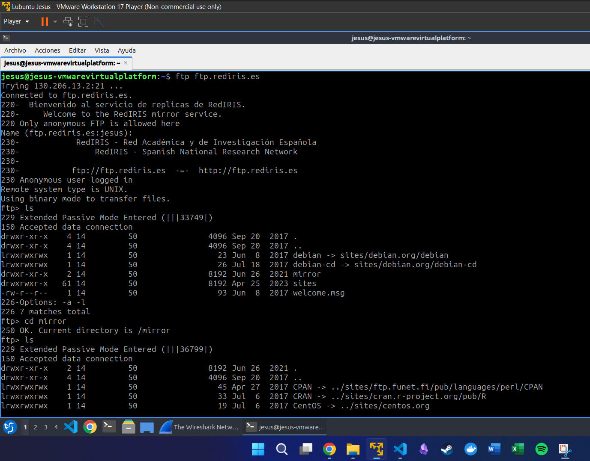
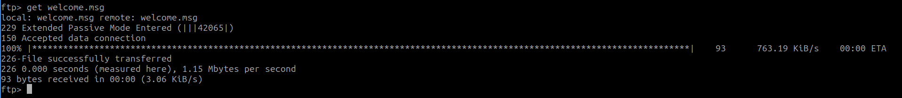
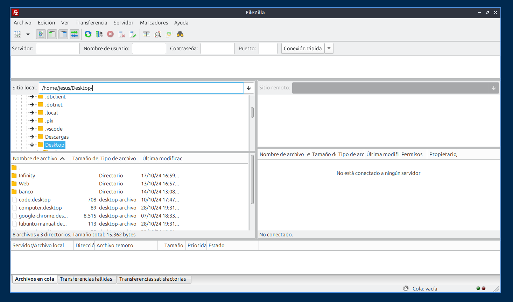
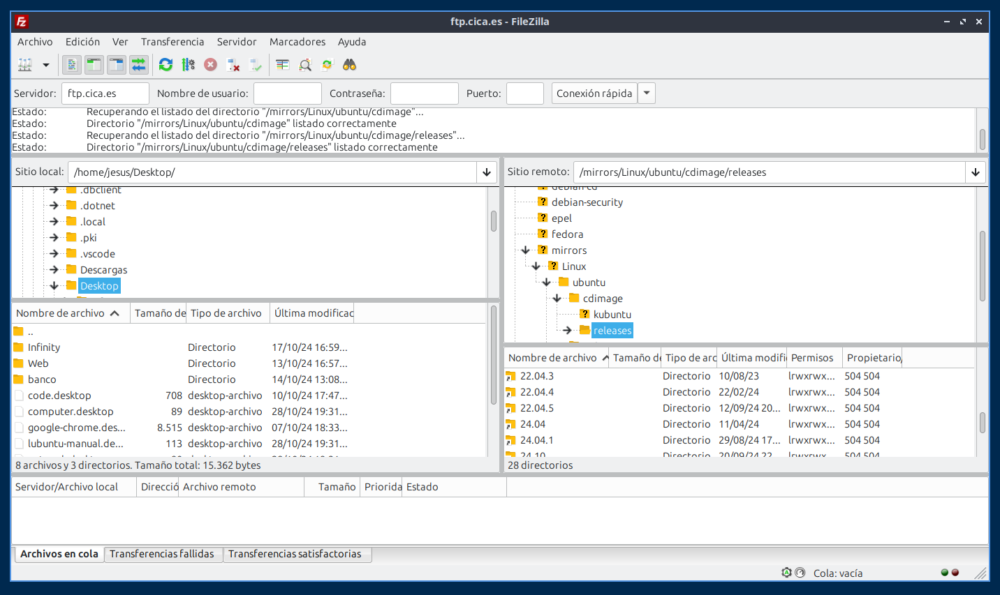
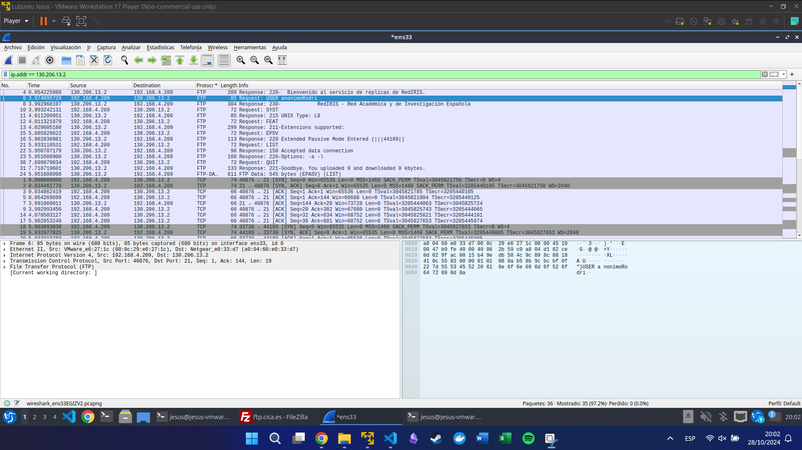

# Práctica 10 - Servicio de transferencia de ficheros

## Contestad, razonad y justificad las siguientes cuestiones que se plantean

1. **¿Qué es FTP?**

FTP es un protocolo de red para la transferencia de archivos entre sistemas conectados a una red TCP (Transmission Control Protocol), basado en la arquitectura cliente-servidor. FTP es un protocolo de la capa de aplicación que utiliza el modelo cliente-servidor para transferir archivos entre computadoras. Un cliente FTP es un programa que se utiliza para transferir archivos entre computadoras. Un servidor FTP es un programa que se utiliza para transferir archivos entre computadoras.

2. **El servicio de transferencia de ficheros es utilizado en la administración de sitios WEB. ¿Cómo?**

El servicio de transferencia de archivos se utiliza en la administración de sitios web para transferir archivos entre computadoras. Por ejemplo, un administrador de un sitio web puede utilizar el servicio de transferencia de archivos para transferir archivos entre su computadora y el servidor web que aloja el sitio web. De esta manera, el administrador puede actualizar el contenido del sitio web, cargar nuevos archivos, eliminar archivos antiguos, etc.

3. **Desde la interfaz de comandos de MSDOS conectaros al servidor FTP de rediris (ftp.rediris.es) de forma anónima. ¿Cuál es el usuario habitual para una conexión anónima?**

El usuario habitual para una conexión anónima es `anonymous`.

4. **Recorred los distintos directorios disponibles y analizad la información disponible en el directorio \mirror (información pública y de libre distribución).**

5. **Descargad algún fichero.**

6. **¿Qué es un cliente FTP?**

Un cliente FTP es un programa que se utiliza para transferir archivos entre computadoras utilizando el protocolo FTP. Un cliente FTP permite a los usuarios conectarse a un servidor FTP, navegar por los directorios del servidor, transferir archivos entre el cliente y el servidor, etc.

7. **¿Qué clientes FTP gratuítos conocéis?**

Algunos clientes FTP gratuitos conocidos son FileZilla Client, WinSCP, Cyberduck, etc.

8. **Instalad un cliente FTP.**

9. **Con el cliente FTP instalado conectaos al sitio ftp.cica.es. ¿En qué directorio podemos descargar la distribución linux UBUNTU?**

10. **¿Qué es filewatcher.com?**

Filewatcher.com es un sitio web que permite a los usuarios buscar y descargar archivos de Internet. Los usuarios pueden buscar archivos por nombre, extensión, tamaño, fecha de modificación, etc. y descargar los archivos que deseen.

11. **Encuentra algún servidor FTP desde el que descargar el navegador Firefox.**

ftp.mozilla.org

12. **Con un monitor de red capturad los paquetes que llegen o salgan de vuestra tarjeta de red al conectaros a un servidor FTP y al descargaos un archivo.**

13. **¿Qué puerto se utiliza cuando se inicia una conexión con un servidor FTP?**

El puerto que se utiliza cuando se inicia una conexión con un servidor FTP es el puerto 21.

14. **¿Qué ordenes ha enviado al servidor FTP?**

15. **Cuando realizáis una transferencia de información, al obtener un listado de un directorio o al transferir un fichero, ¿qué puerto se utiliza?**

Se utiliza el puerto 20.
