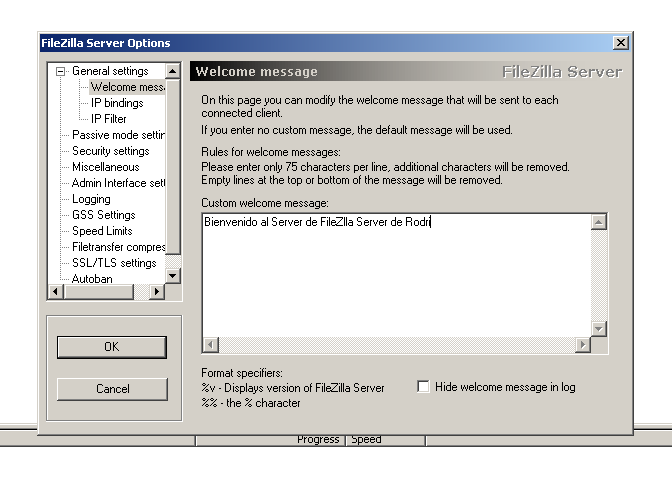
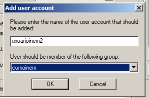
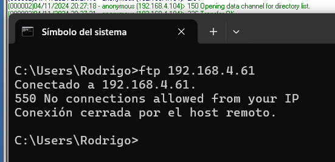

# Práctica 11 - Filezilla Server

## Cread un documento que explique el proceso seguido en esta práctica y contestad las cuestiones que se plantean. Los pasos que tenéis que realizar son los siguientes

1. **Instalad un servidor FTP en una máquina Windows. Se recomienda Filezilla Server.**
1. **Configuradlo de acuerdo con los siguientes patrones sugeridos para un sitio FTP de descargas:**

- **Poned una contraseña de administración.**

- **Estableced el mensaje de bienvenida.**

- **Cread en vuestro disco duro un directorio llamado ftp.**

- **Cread un usuario anonymous y dadle permiso de lectura (Read) y de listar (List) los ficheros del directorio ftp.**

- **Cread un directorio dentro del directorio ftp llamado upload. Para el usuario anonymous dad permiso de escritura (Write) y de creación de directorios (Create) sobre dicho directorio. De esta forma, si un usuario anónimo te quiere dejar algo, lo podrá hacer, pero en esa carpeta. Al no tener permiso de borrado (Delete), no podrá borrar nada, sólo dejar cosas.**

- **Limitad la velocidad al usuario anonymous. Para poder dar servicio a un número previsto de clientes a la vez hay que tener en cuenta la velocidad de la conexión al proveedor de Internet. ¿Qué velocidad nos resulta más crítica?**

- **Cread un grupo de usuarios llamado cursoinem y conceded los permisos que creais convenientes.**

- **Cread usuarios concretos para el grupo cursoinem.**

- **Filtrar el acceso por direcciones IP. Tened en cuenta que el filtrado se puede hacer total para una IP o para el par IP-usuario.**

  