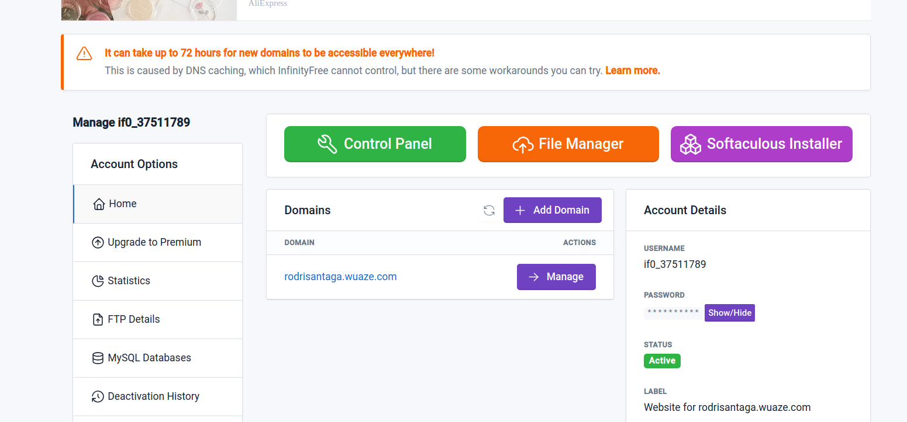
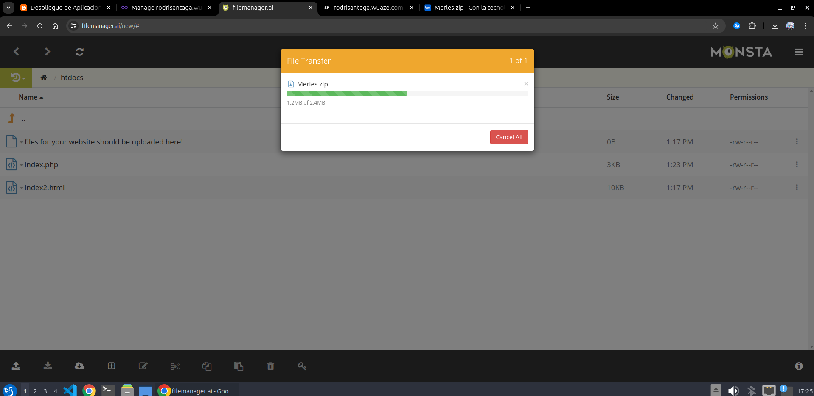
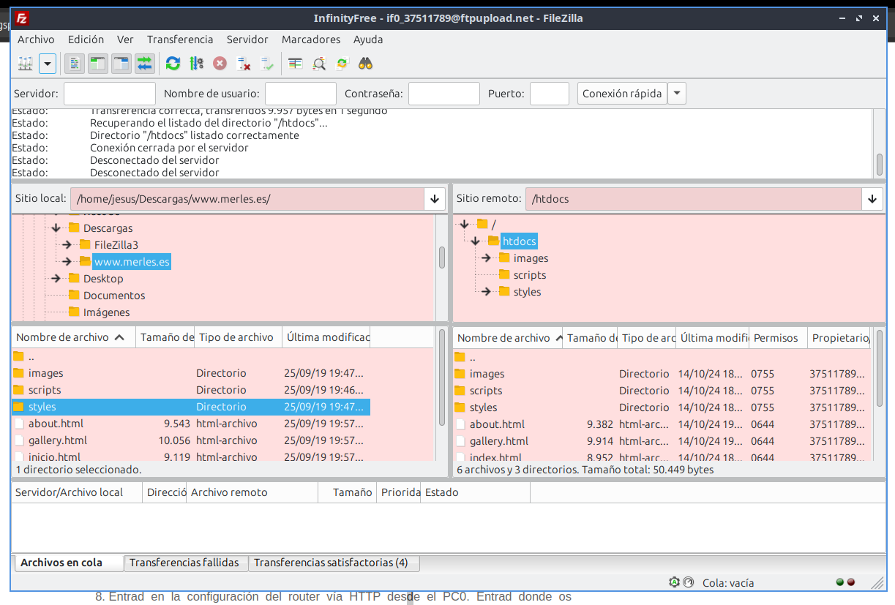

# Práctica 12 - Soluciones comerciales de alojamiento

## Contestad, razonad y justificad las siguientes cuestiones que se plantean

1. **Se han visto las dificultades que plantea dar servicios en Internet usando un alojamiento propio. También se ha visto la calidad del servicio ofrecido. Vamos a explorar la opción de externalizar estos servicios. Existen soluciones comerciales, algunas gratuítas. Estas soluciones suelen proveer ciertos servicios y les asocian un nombre de dominio. También suelen incluir herramientas para la creación de páginas WEB sin necesidad de tener conocimientos de HTML. Además es habitual que faciliten herramientas de instalación de aplicaciones como tiendas online, plataformas educativas... Normalmente las soluciones gratuítas, como por ejemplo los foros gratuítos, insertan publicidad en la página como forma de obtener los ingresos que el cliente no abona. Esto puede no ser adecuado en algunos casos. Además, las soluciones gratuítas van a proporcionar un nombre de dominio del tipo mi_sitio.proveedor_del_servicio.com, y esto tampoco es adecuado para ciertos sitios WEB. Cread una tabla con opciones comerciales para alojamiento de servicios de Internet en la que aparezca el nombre del proveedor, su dirección WEB, servicios que ofrece, coste, publicidad insertada si o no, herramientas proporcionadas para la gestión de los servicios...**

| Proveedor | Dirección WEB | Servicios | Coste | Publicidad | Herramientas |
|-----------|---------------|-----------|-------|------------|-------------|
| InfinityFree | [InfinityFree](https://infinityfree.net/) | Alojamiento WEB, bases de datos, correo electrónico, instalación de aplicaciones... | Gratuito | Sí | Sí |
| Replit | [Replit](https://replit.com/) | Alojamiento WEB, bases de datos, correo electrónico, instalación de aplicaciones... | Gratuito | Sí | Sí |
| Byet Hots | [ByetHost](https://byet.host/) | Alojamiento WEB, bases de datos, correo electrónico, instalación de aplicaciones... | Gratuito | Sí | Sí |
| AwardSpace | [AwardSpace](https://www.hostinger.es/) | Alojamiento WEB, bases de datos, correo electrónico, instalación de aplicaciones... | 0,99€/mes | No | Sí |
| BlueHost | [BlueHost](https://www.bluehost.com/) | Alojamiento WEB, bases de datos, correo electrónico, instalación de aplicaciones... | 2,95€/mes | No | Sí |
| SiteGround | [SiteGround](https://www.siteground.es/) | Alojamiento WEB, bases de datos, correo electrónico, instalación de aplicaciones... | 3,95€/mes | No | Sí |

2. **Registraros como usuarios en un alojamiento gratuito para crear un sitio WEB. Se recomienda ninfinityfree.com y replit.**

3. **Al confirmarse el registro no olvidéis tomar nota de los parámetros proporcionados para conexión y administración.**
4. **Poned en explotación este sitio WEB utilizando las facilidades de administración vía WEB proporcionadas por el alojamiento.**

5. **Probad el funcionamiento de vuestro sitio WEB.**

6. **Poned en explotación este sitio WEB utilizando un cliente FTP.**

