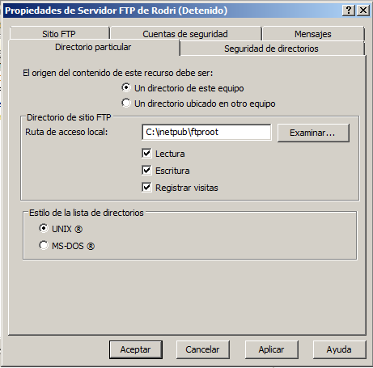
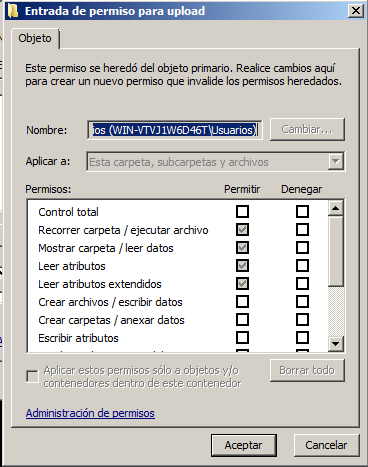
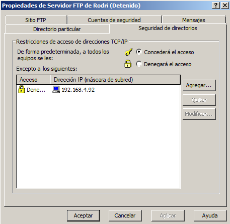

# Práctica 13 - Servidor FTP IIS

1. **Abrid una máquina virtual Windows Server con VMware Player.**
2. **Comprobad y corregir, si es necesario, el estado y configuración del servidor IIS para que funcione el servicio FTP.**

3. **¿Donde se encuentra la carpeta que va a ser directorio raiz del servicio FTP?**

4. **¿Qué usuarios pueden acceder al servicio?**

Los usuarios que pueden acceder al servicio son los usuarios del sistema.

5. **¿Qué significa aislar usuarios?**

Aislar usuarios significa que cada usuario tiene su propio directorio raíz.

6. **Configurad el servicio FTP de manera que los usuarios puedan subir archivos sólo en una carpeta "upload" y bajarlos desde cualquier carpeta.**

7. **Configurad el servicio FTP de manera que se bloquee el acceso desde determinadas IPs.**

