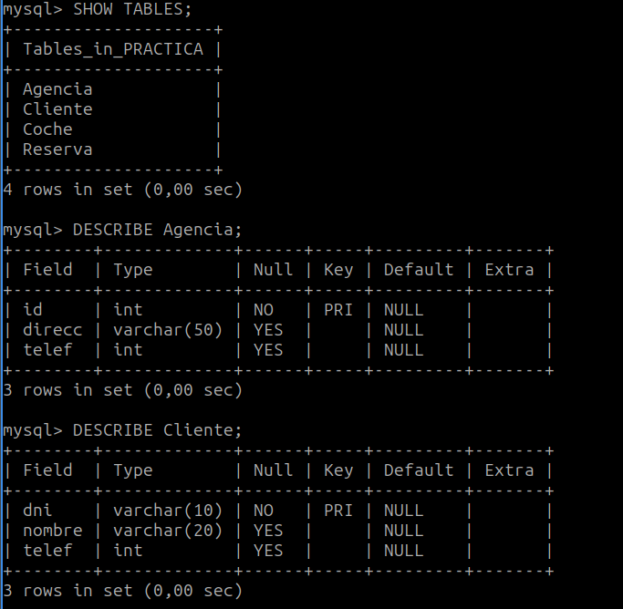

# Practica 14 - Creación de una base de datos en MySQL

1. **Se quiere crear una base de datos en un SGBD MySQL para una empresa de alquiler de coches de acuerdo con el siguiente esquema relacional:**

```java
    Agencia(#id, direcc, telef);
    Coche(#matricula, marca, modelo, fecha_matriculacion, 
    precio_dia, num_kms, id_agencia);
    Cliente(#dni, nombre, telef);
    Reserva(#id, fec_ini, fec_fin, dni_cliente, matricula_coche);
    Coche.id_agencia ⊆ Agencia.id;
    Reserva.dni_cliente ⊆ Cliente.dni;
    Reserva.matricula_coche ⊆ Coche.matricula;
```

2. **Realizad todas las operaciones necesarias en línea de comandos de MySQL.**

```sql
CREATE TABLE Agencia (
    id INT PRIMARY KEY,
    direcc VARCHAR(50),
    telef INT
);
```

```sql
CREATE TABLE Coche (
    matricula VARCHAR(10) PRIMARY KEY,
    marca VARCHAR(20),
    modelo VARCHAR(20),
    fecha_matriculacion DATE,
    precio_dia DECIMAL(10,2),
    num_kms INT,
    id_agencia INT,
    FOREIGN KEY (id_agencia) REFERENCES Agencia(id)
);
```

```sql
CREATE TABLE Cliente (
    dni VARCHAR(10) PRIMARY KEY,
    nombre VARCHAR(20),
    telef INT
);
```

```sql
CREATE TABLE Reserva (
    id INT PRIMARY KEY,
    fec_ini DATE,
    fec_fin DATE,
    dni_cliente VARCHAR(10),
    matricula_coche VARCHAR(10),
    FOREIGN KEY (dni_cliente) REFERENCES Cliente(dni),
    FOREIGN KEY (matricula_coche) REFERENCES Coche(matricula)
);
```

3. **Comprobad la creación de las tablas mediante el comando DESCRIBE.**




4. **Insertad diversos registros en las tablas de la base de datos en línea de comandos de MySQL.**

```sql
INSERT INTO Agencia (id, direcc, telef) VALUES
(1, 'Calle Mayor, 45', 987654321),
(2, 'Avenida del Sol, 12', 912345678),
(3, 'Plaza Nueva, 3', 622334455);
```

```sql
INSERT INTO Coche (matricula, marca, modelo, fecha_matriculacion, 
precio_dia, num_kms, id_agencia) VALUES
('1234ABC', 'Toyota', 'Corolla', '2020-05-15', 50.00, 30000, 1),
('5678DEF', 'Ford', 'Focus', '2018-07-20', 45.00, 50000, 2),
('9101GHI', 'Volkswagen', 'Golf', '2022-03-10', 60.00, 15000, 1),
('2345JKL', 'Honda', 'Civic', '2019-11-25', 55.00, 25000, 3);
```

```sql
INSERT INTO Cliente (dni, nombre, telef) VALUES
('12345678A', 'Juan Pérez', 611223344),
('87654321B', 'María Gómez', 699887766),
('45678901C', 'Luis Rodríguez', 622445566),
('10987654D', 'Ana López', 688223344);
```

```sql
INSERT INTO Reserva (id, fec_ini, fec_fin, dni_cliente, 
matricula_coche) VALUES
(1, '2024-11-01', '2024-11-10', '12345678A', '1234ABC'),
(2, '2024-12-15', '2024-12-20', '87654321B', '5678DEF'),
(3, '2025-01-05', '2025-01-12', '45678901C', '9101GHI'),
(4, '2025-02-01', '2025-02-07', '10987654D', '2345JKL');
```

5. **Se necesitarán varios usuarios para la gestión y explotación de la base de datos. El usuario *avis* tendrá permisos totales sobre todos los recursos.**

```sql
CREATE USER 'avis'@'localhost' IDENTIFIED BY 'avis';
```

```sql
GRANT ALL PRIVILEGES ON *.* TO 'avis'@'localhost';
```


**El usuario *visor* tendrá sólo permiso para una vista en la que se detallarán las agencias y los coches de cada una de ellas.**

```sql
CREATE USER 'visor'@'%' IDENTIFIED BY 'visor';
```

```sql
CREATE VIEW Vista_AgenciasCoches AS
SELECT a.id AS id_agencia, a.direcc, a.telef, c.matricula, c.marca, c.modelo, c.precio_dia, c.num_kms
FROM Agencia a
JOIN Coche c ON a.id = c.id_agencia;
```

```sql
GRANT SELECT ON Vista_AgenciasCoches TO 'visor'@'%';
```

**El usuario *gestor* tendrá acceso a una vista que relacione reservas con vehículos y clientes.**

```sql
CREATE USER 'gestor'@'localhost' IDENTIFIED BY 'gestor';
```

```sql
CREATE VIEW Vista_ReservasVehiculosClientes AS
SELECT r.id, r.fec_ini, r.fec_fin, c.nombre AS nombre_cliente, c.telef AS telef_cliente, co.marca, co.modelo, co.matricula
FROM Reserva r
JOIN Cliente c ON r.dni_cliente = c.dni
JOIN Coche co ON r.matricula_coche = co.matricula;
```

```sql
GRANT SELECT ON Vista_ReservasVehiculosClientes TO 'gestor'@'localhost';
```

**El usuario *gestor* también tendrá acceso en lectura a las tablas de clientes y reservas.**

```sql
GRANT SELECT
ON Cliente, Reserva
TO 'gestor'@'localhost';
```

**Finalmente, el usuario gestor podrá hacer inserts en la tabla de reservas. Todos los accesos sólo estarán permitidos desde localhost. Realizad todas las operaciones necesarias en línea de comandos de MySQL.**

```sql
GRANT INSERT
ON Reserva
TO 'gestor'@'localhost';
```

```bash
/etc/mysql/mysql.conf.d/mysqld.cnf
```
