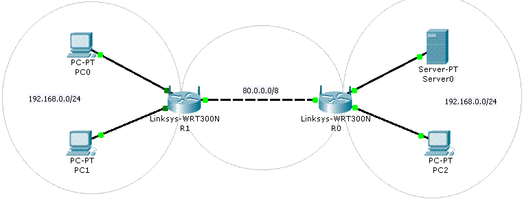

# Práctica de ampliación 2 - NAT

## Después de ver este vídeo contestad, razonad y justificad las siguientes cuestiones que se plantean

1. **Hasta ahora hemos ofrecido servicios en la red local. Para ofrecer servicios a Internet se plantean varios problemas. Por ejemplo, ¿cuál es la IP de nuestro equipo servidor en Internet?**

La IP de nuestro equipo servidor en Internet es la IP pública que nos proporciona el ISP.

2. **¿Qué es un ISP?**

El ISP (Internet Service Provider) es un proveedor de servicios de Internet que ofrece servicios de acceso, transmisión, almacenamiento y otros servicios relacionados o conectados a Internet.

3. **Cuando se contratan los servicios básicos de un ISP, ¿cuántas IPs nos proporciona?**

Proporciona sola una IP pública, pero si se contrata un servicio de IP fija, se puede tener más de una IP pública.

4. **¿Qué son las direcciones IP privadas?**

Las direcciones IP privadas son direcciones IP que se pueden utilizar en una red local, pero no se pueden utilizar en Internet.

5. **¿Cuáles son los rangos reservados para direcciones IP privadas?**

Las direcciones IP privadas están reservadas en los siguientes rangos:

- Clase A: 10.0.0.0 a 10.255.255.255
- Clase B: 172.16.0.0 a 172.31.255.255
- Clase C: 192.168.0.0 a 192.168.255.255

6. **¿Qué es NAT?**

NAT (Network Address Translation) es un método que permite a los dispositivos en una red privada utilizar una sola dirección IP pública para acceder a Internet.

7. **¿Cuál es su misión?**

La misión de NAT es permitir que los dispositivos en una red privada utilicen una sola dirección IP pública para acceder a Internet.

8. **¿Qué relación hay entre el uso de NAT y el protocolo IPv4?**

La relación entre el uso de NAT y el protocolo IPv4 es que NAT permite que los dispositivos en una red privada utilicen una sola dirección IP pública para acceder a Internet, lo que permite que se utilicen direcciones IP privadas en una red local.

9.  **¿Incorporan los encaminadores proporcionados por los ISPs el servicio NAT?**

Sí, los encaminadores proporcionados por los ISPs incorporan el servicio NAT.

10. **¿Es necesario usar NAT a la hora de crear servidores que den servicio sólo a nuestra red local?**

No, no es necesario usar NAT a la hora de crear servidores que den servicio sólo a nuestra red local.

11. **Conseguida una "IP pública" para nuestro servidor, ¿cómo podríamos probar su funcionamiento?**

Para probar el funcionamiento de un servidor con una IP pública, se puede acceder al servidor desde un dispositivo que no esté en la red local.

12. **¿Cómo podríamos asociar un nombre de dominio a la dirección IP pública? ¿Hay alguna opción de hacerlo de manera gratuíta?**

Se puede asociar un nombre de dominio a la dirección IP pública utilizando un servicio de DNS. Sí, hay opciones de hacerlo de manera gratuita, como por ejemplo, utilizando un servicio de DNS gratuito.

13. **¿Qué os parece el nombre de dominio gratuíto? ¿Lo utilizaríais como dominio para alojarun negocio en Internet?**

Si el nombre de dominio gratuito es fácil de recordar y de escribir, se podría utilizar como dominio para alojar un negocio en Internet.

14. **Conseguida una "IP pública" para nuestro servidor y nombre de dominio, ¿qué pasaría si desconectamos y conectamos el router que nos conecta con el ISP?**

Lo que pasaría si desconectamos y conectamos el router que nos conecta con el ISP es que la IP pública del servidor cambiaría, lo que podría afectar a la disponibilidad del servidor.

15. **¿Qué es la disponibilidad?**

La disponibilidad es la característica o capacidad de asegurar la fiabilidad y el acceso oportuno a los datos y recursos que los soportan por parte de los individuos autorizados, es decir, que lo necesitan para desenvolver sus actividades

16. **¿A qué se llama alta disponibilidad?**

La alta disponibilidad es la capacidad que tiene un sistema de TI para ser accesible y confiable casi todo el tiempo. Se consider alta capacidad a un rango mayor a 99.9999% de disponibilidad.

17. **En relación con la pregunta 14, teniendo en cuenta que el servidor del ejemplo funciona sobre un Windows Server 2008 virtual, gracias a un VMware Player que corre en un XP instalado en un portátil, y que la conexión a Internet está contratada a un ISP que asigna IP pública dinámica, ¿qué amenazas a la alta disponibilidad encontráis?**

Las amenazas a la alta disponibilidad son las siguientes:
- Interrupciones de energía
- Fallos de hardware
- Errores de software
- Desastres naturales

18. **¿Qué es el QoS?**
Con los  datos de que disponéis, ¿hasta qué punto creéis que el servidor va a ofrecer una calidad de servicio aceptable?
Con Packet Tracer, a partir del esquema que se muestra a continuación, se pide configurar la IP y la máscara de cada equipo de la red, configurar los servicios de Server0, modificar la página WEB de inicio de Server0 y conseguir que Server0 dé servicio a PC2, PC0 y PC1.

(Actividad de ampliación) Dad un servicio en Internet desde un dispositivo de vuestra casa, realizad una guía de como lo conseguís y probad dicho servicio en clase.

19. **Con los  datos de que disponéis, ¿hasta qué punto creéis que el servidor va a ofrecer una calidad de servicio aceptable?**

Bajo las condiciones descritas, es probable que la calidad de
servicio ofrecida por el servidor sea limitada. Para mejorar la
QoS, sería recomendable considerar:

- Mejorar el Hardware: Usar un servidor dedicado con recursos
adecuados.
- Actualizar Software: Migrar a sistemas operativos más recientes
y seguros.
- Optimizar la Red: Implementar QoS para priorizar el tráfico
crítico y asegurar una conexión a internet más estable.
- Plan de Copias de Seguridad: Establecer un plan regular para
proteger los datos y asegurar la disponibilidad.

20. **Con Packet Tracer, a partir del esquema que se muestra a continuación, se pide configurar la IP y la máscara de cada equipo de la red, configurar los servicios de Server0, modificar la página WEB de inicio de Server0 y conseguir que Server0 dé servicio a PC2, PC0 y PC1.**

