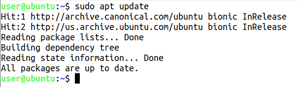
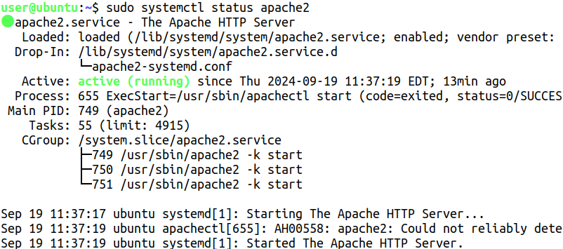
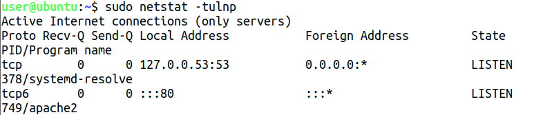
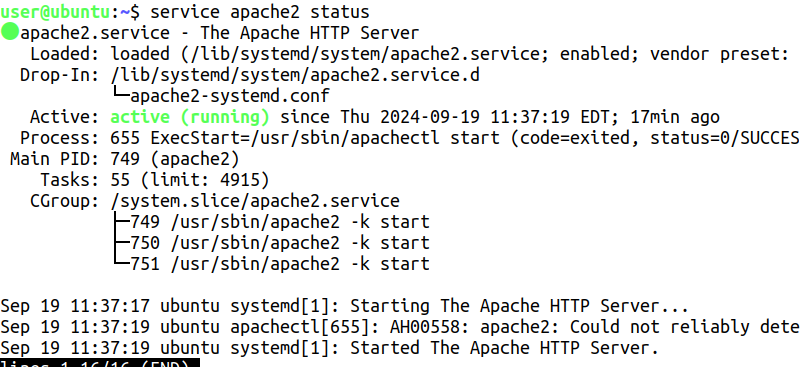

# Práctica 6 - Servidor Apache en Linux

**Abrid una máquina Linux con VMware Player.**
**Configurad la máquina virtual para tener acceso a Internet.**
**Cambiad la configuración del teclado. Poned el teclado español.**

Con el comando `dpkg-reconfigure keyboard-configuration` se puede cambiar la configuración del teclado.

**¿Cómo podemos abrir el intérprete de comandos?**

El interprete de comandos se puede abrir con la combinación de teclas `Ctrl + Alt + T`.

**Para instalar software, administrar usuarios... tenemos que tener privilegios de root en el sistema. ¿Para qué sirve el comando su?**

El comando `su` sirve para cambiar de usuario en la terminal.

**¿Y el comando sudo?**

El comando `sudo` sirve para ejecutar comandos como superusuario.

**Es necesario actualizar los repositorios con el comando apt-get update.**

**Instalad el servidor WEB Apache (Instalación de Apache en Fedora/Instalación en Ubuntu y familia).**

**¿Qué problemas estáis encontrando?**

Por el momento ningún problema.

**¿Cómo probamos que el servicio WEB está funcionando?**

**Otra forma de probarlo es ver si hay algún proceso utilizando el puerto 80 en escucha mediante el comando netstat. Probadlo.**

**Otra forma de probarlo es ejecutar el comando service nombre_de_servicio status. Probadlo.**

**Probad el funcionamiento del servidor desde otra máquina. ¿Funciona? Si no es así, ¿qué puede estar pasando? Solucionadlo con "ajuste fino".**

Sí, funciona

**Poned en explotación este sitio WEB adaptándolo a la configuración por defecto del servidor.**

**Poned en explotación el mismo sitio WEB cambiando la configuración del servidor suponiendo que queremos tener nuestro sitio WEB en /WEB con página de inicio inicio.html. En Fedora puede haber problemas con SELinux y habría que desactivarlo.**

**¿Qué es un registro de operaciones?**

Un registro de operaciones es un archivo que contiene información sobre los eventos que han ocurrido en un sistema.

**¿En qué lugar se encuentra el registro de operaciones de Apache?**

El registro de operaciones de Apache se encuentra en el archivo `/var/log/apache2/access.log`.
