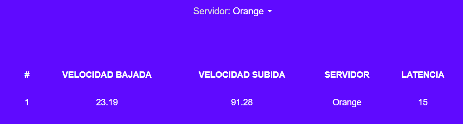
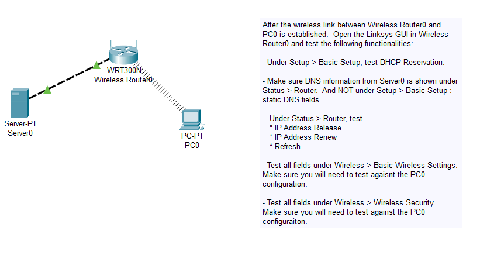
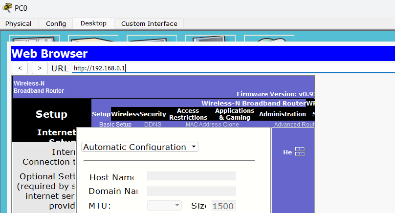
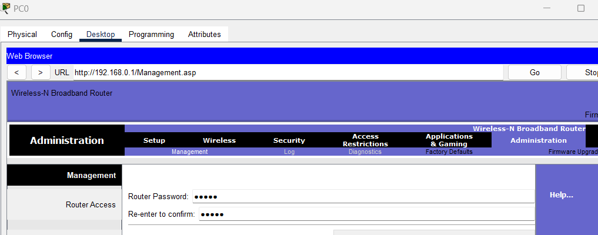
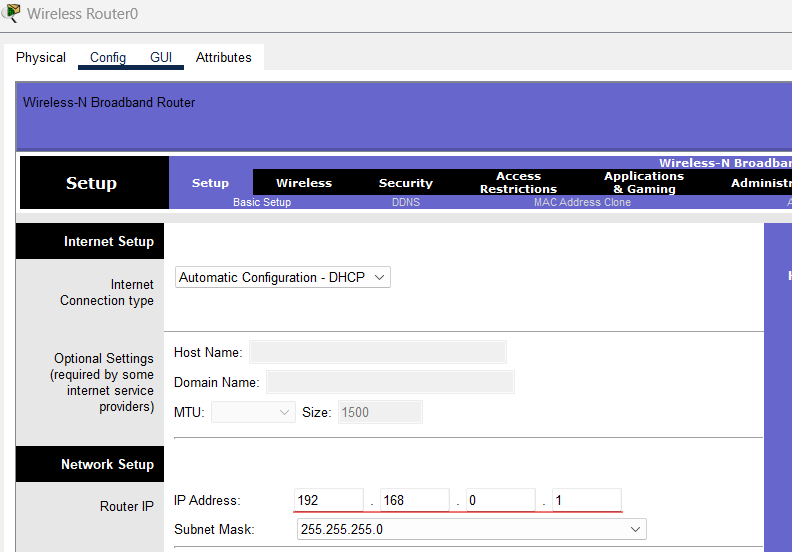
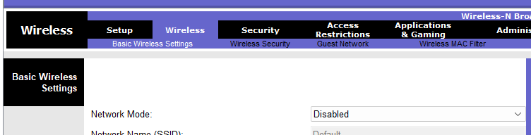
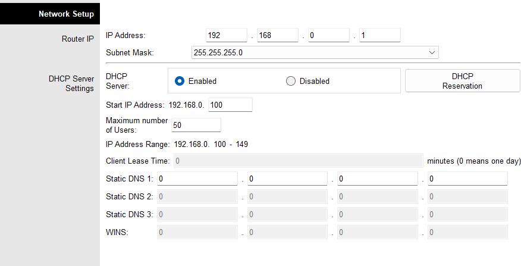
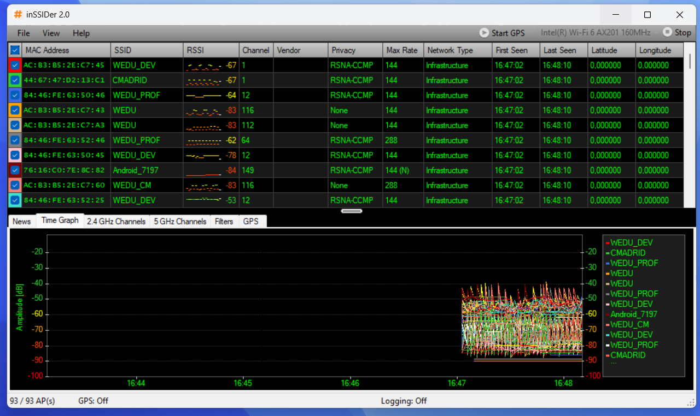
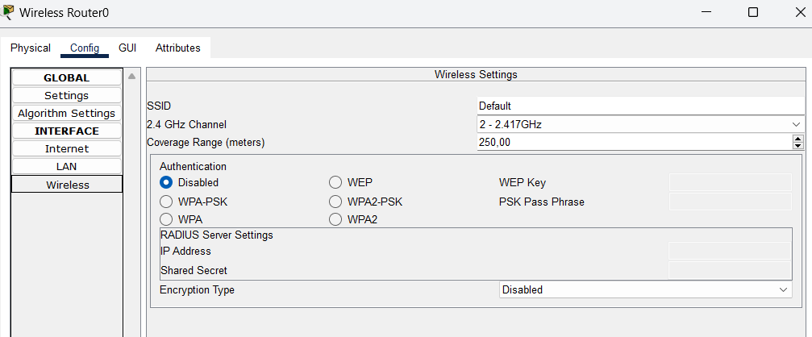
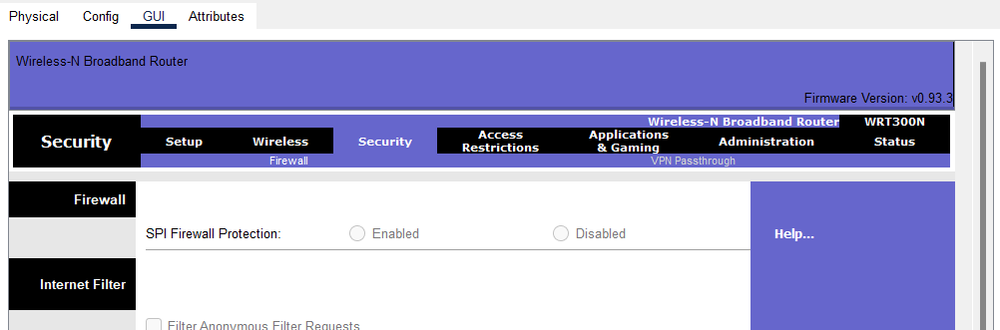

# Práctica 9 - La conexión a Internet

## Contestad, razonad y justificad las siguientes cuestiones que se plantean.

1. **Medid la velocidad de transmisión que se consigue en vuestra conexión a Internet. Podeis utilizar le servicio de cálculo de velocidad ofrecido por http://www.testdevelocidad.es/, http://www.internautas.org/, http://testdeacceso.es.tdatacenter.com/, http://www.velocimetro.org/...**

2. **¿Por qué son distintas las velocidades de bajada y subida?**

La principal razón de la diferencia entre velocidades de subida y bajada es la naturaleza asimétrica de la mayoría de las infraestructuras de red y el hecho de que la mayoría de los usuarios requiere más capacidad de descarga.

3. **¿Qué significa ADSL?**

Son las siglas de ***Asymmetric Digital Subscriber Line***, que es una tecnología de comunicación de datos.

4. **¿Qué ventajas e inconvenientes presentan las redes inalámbricas?**

- Ventajas:
  - Facilidad de instalación.
  - Movilidad.
  - Flexibilidad.
  - Escalabilidad.
  - Coste.

- Inconvenientes:
  - Seguridad.
  - Interferencias.
  - Velocidad.
  - Cobertura.

5. **¿Que es el ESSID de una red inalámbrica?**

El ESSID es el nombre de la red inalámbrica. Es el nombre que se le da a la red inalámbrica para que los dispositivos puedan identificarla y conectarse a ella.

6. **Abrid el escenario "dhcp_linksys_server.pkt" que se encuentra en los ejemplos ("Saves\Linksys") de Packet Tracer.**

7. **Desde el PC0, ¿cómo podriais configurar el router?**

Se puede configurar el router desde el PC0 accediendo a la configuración del router vía HTTP. Para ello, se debe abrir un navegador web y escribir la dirección IP del router en la barra de direcciones.

8. **Entrad en la configuración del router vía HTTP desde el PC0. Entrad donde os parezca y cambiad lo que os parezca.**

9.  **¿Qué opináis de las claves por defecto para entrar a la administración del router?**

Son claves bastante inseguras, al ser algo tan común, es fácil que alguien pueda acceder a la configuración del router.

10. **Explicad los pasos para cambiar la contraseña de administración.**

Debemos cambiar la contraseña desde el apartado de administracion en la configuración del router. En este caso, la opción se encuentra en la pestaña de "Administración" y luego en "Administración de contraseña".

11. **¿Cuál es la marca y modelo del router?**

La marca del router es Wireless-N Broadband router y el modelo es WRT300N.

12. **¿Como se puede modificar la IP del router?**

En la configuración del router, en la pestaña de "Setup" y se puede modificar la IP del router.

13. **¿Y su máscara de subred?**

La máscara de subred se puede modificar en la misma pestaña de "Setup" en la configuración del router.

14. **¿Cómo se desactiva el WiFi? ¿Qué utilidad tiene el hacerlo?**

Para desactivar el WiFi, se debe ir a la pestaña de "Wireless" y poner la opcion Network Mode en "disabled".

15. **¿Este router integra un servidor DHCP? Si es así, ¿donde se puede habilitar o deshabilitar?**

16. **¿Qué significan las opciones "Start IP" y "End IP" al configurar un servidor DHCP?**

Esa opción se utiliza para configurar el rango de direcciones IP que se asignarán a los dispositivos que se conecten a la red.

17. **Habilitar o deshabilitar el servidor DHCP, junto con la modificación de la IP del router, ¿tiene consecuencias relacionadas con la intrusión en nuestra red?**

Sí, ya que si deshabilitamos el servidor DHCP, los dispositivos que se conecten a la red no recibirán una dirección IP automáticamente y tendrán que configurarla manualmente.

18. **¿Se podría deshabilitar el uso como router inalámbrico?**

Sí, se puede deshabilitar el uso como router inalámbrico desde la configuración del router.

19. **¿Qué son los canales WIFI?**

Los canales WiFi son las frecuencias en las que se emite la señal de la red inalámbrica.

20. **¿Donde se configura el canal WIFI en nuestro router?**

Se puede configurar el canal WiFi en la pestaña de "Wireless" en la configuración del router.

21. **Observad el uso de los canales WIFI usando el programa inSSIDer. (Sólo si se dispone de tarjeta de red WiFi)**

22. **El hecho de que nuestro ESSID sea visible, ¿facilita la conexiónes no deseadas? Si es así, ¿cómo podríamos cambiar ésto?**

El hecho de que el ESSID sea visible facilita las conexiones no deseadas, ya que cualquier dispositivo puede ver la red y conectarse a ella. Para cambiar esto, se puede desactivar la emisión del ESSID desde la configuración del router.

23. **¿Qué es encriptar?**

Encriptar es el proceso de codificar información para que solo las personas autorizadas puedan acceder a ella.

24. **¿Qué es la encriptación WiFi?**

La encriptación WiFi es un método de seguridad que se utiliza para proteger las redes inalámbricas de accesos no autorizados.

25. **¿Qué tipos de encriptación WiFi conoces?**

Los tipos de encriptación WiFi más comunes son WEP, WPA y WPA2.

26. **¿Cómo se encuentra la encriptación en nuestro WiFi y que consecuencias tiene?**

La encriptación en nuestro WiFi se encuentra desactivada, lo que significa que la red no está protegida y cualquiera puede conectarse a ella.

27. **¿Qué encriptación recomiendas y qué cambios recomiendas?**

Recomendaría utilizar WPA2, ya que es el método de encriptación más seguro. Para cambiar la encriptación, se debe ir a la configuración del router y seleccionar WPA2 en la pestaña de "Wireless".

28. **¿Qué opinas del nombre WEP?**

WEP es un método de encriptación obsoleto y poco seguro, por lo que no se recomienda utilizarlo.

29. **¿Qué es un filtro MAC? ¿Cómo se configura el filtro MAC en nuestro router?**

Un filtro MAC es una lista de direcciones MAC de dispositivos autorizados que pueden conectarse a la red. Se puede configurar el filtro MAC en la configuración del router, en la pestaña de "Wireless" y luego en "Wireless MAC Filter".

30. **¿Qué es un firewall?**

Un firewall es un sistema de seguridad que se utiliza para proteger una red de accesos no autorizados. Bloquea el tráfico no deseado y permite el tráfico autorizado.

31. **¿Lo integra nuestro router?**

No se puede activar el firewall en el router.

32. **¿Cómo configuraríais un router inalámbrico para dificultar lo máximo posible las conexiones no deseadas?**

Para dificultar las conexiones no deseadas, se pueden seguir los siguientes pasos:
- Activar la encriptación WPA2.
- Desactivar la emisión del ESSID.
- Configurar un filtro MAC.
- Cambiar la contraseña de administración.
- Cambiar la contraseña de la red WiFi.
- Configurar un firewall si es posible.
- Actualizar el firmware del router.
