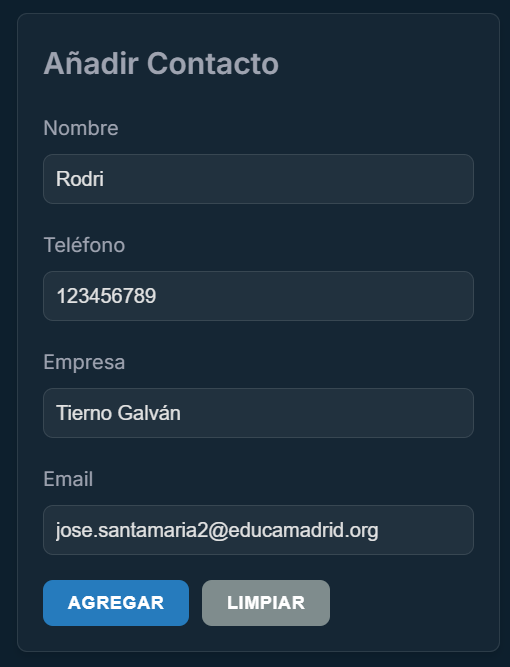
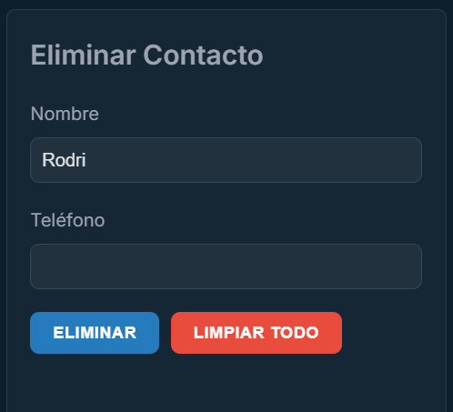
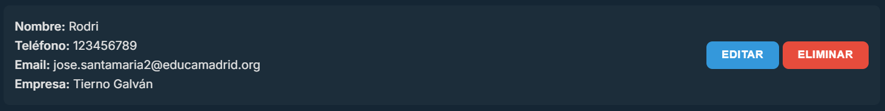

# Manual de Usuario de la Agenda Online

## Tabla de Contenidos

- [Manual de Usuario de la Agenda Online](#manual-de-usuario-de-la-agenda-online)
  - [Tabla de Contenidos](#tabla-de-contenidos)
  - [Introducción](#introducción)
  - [Requisitos](#requisitos)
  - [Instalación](#instalación)
  - [Uso](#uso)
    - [Añadir un contacto](#añadir-un-contacto)
    - [Eliminar un contacto](#eliminar-un-contacto)
    - [Buscar un contacto](#buscar-un-contacto)
    - [Editar un contacto](#editar-un-contacto)

## Introducción

Este manual de usuario tiene como objetivo explicar el funcionamiento de la Agenda Online, una aplicación web que permite a los usuarios gestionar sus contactos de forma sencilla y eficiente. La aplicación cuenta con una interfaz intuitiva y fácil de usar, que permite añadir, editar y eliminar contactos de la agenda, así como buscarlos por nombre o empresa.

## Requisitos

Para poder utilizar la Agenda Online, es necesario contar con un navegador web actualizado (Google Chrome, Mozilla Firefox, Safari, etc.). No es necesario instalar ningún software adicional en el equipo ni tener conexión a internet, ya que la aplicación se ejecuta en local.

## Instalación

Para instalar la Agenda Online, simplemente descarga el archivo ZIP y descomprímelo en la carpeta de tu elección. A continuación, abre el archivo `index.html` con tu navegador web y la aplicación se cargará automáticamente.

## Uso

Una vez cargada la aplicación, podrás empezar a utilizarla de inmediato. Para añadir un nuevo contacto, haz clic en el botón `Añadir contacto` y rellena los campos del formulario. Para editar un contacto existente, haz clic en el botón `Editar` junto al contacto que desees modificar. Para eliminar un contacto, haz clic en el botón `Eliminar` junto al contacto que desees eliminar.

### Añadir un contacto

Para añadir un nuevo contacto a la agenda, sigue estos pasos:

  

1. Haz clic en el botón `Agregar` para añadir el contacto a la agenda.
2. El contacto se añadirá a la lista y podrás verlo en la interfaz principal.

### Eliminar un contacto

Se pueden eliminar contactos de la agenda de 2 maneras:

1. Haz clic en el botón `Eliminar` junto al contacto que desees eliminar.
2. El contacto se eliminará de la lista y ya no aparecerá en la interfaz principal.

---

1. Escribe el nombre o el telfono del contacto que desees eliminar en el campo de búsqueda.
2. Haz clic en el botón `Eliminar`.

  

### Buscar un contacto

Para buscar un contacto en la agenda, sigue estos pasos:

1. Escribe el nombre o la empresa del contacto que desees buscar en el campo de búsqueda.
2. Haz clic en el botón `Buscar` para ver los resultados de la búsqueda.
3. Se mostrarán los contactos que coincidan con el término de búsqueda en la lista principal.

### Editar un contacto

Para editar un contacto existente en la agenda, sigue estos pasos:

1. Haz clic en el botón `Editar` junto al contacto que desees modificar.

  

2. Se pasarán los datos del contacto al formulario, donde podrás modificarlos.
3. Modifica los campos que desees cambiar y haz clic en el botón `Actualizar`.
4. Los cambios se guardarán automáticamente y podrás verlos reflejados en la lista de contactos.