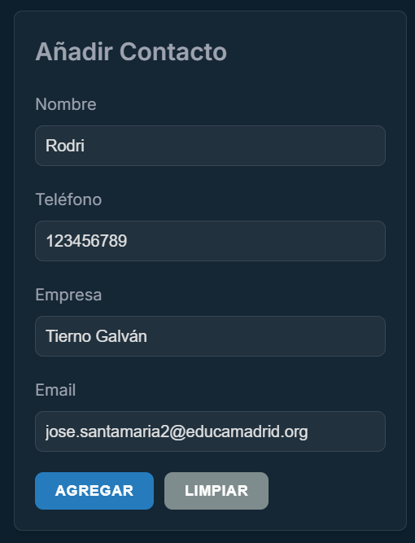
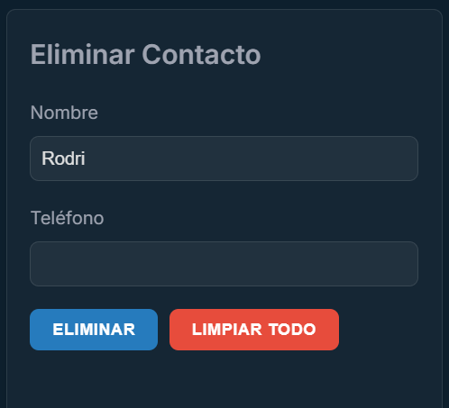
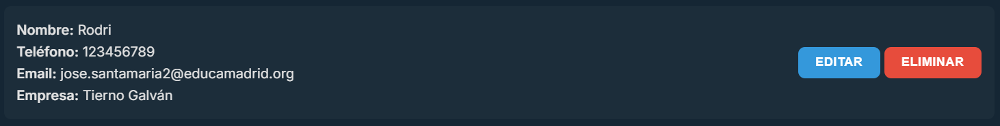

# Online Agenda User Manual

## Table of Contents

- [Online Agenda User Manual](#online-agenda-user-manual)
  - [Table of Contents](#table-of-contents)
  - [Introduction](#introduction)
  - [Requirements](#requirements)
  - [Installation](#installation)
  - [Usage](#usage)
    - [Add a Contact](#add-a-contact)
    - [Delete a Contact](#delete-a-contact)
    - [Search for a Contact](#search-for-a-contact)
    - [Edit a Contact](#edit-a-contact)

## Introduction

This user manual aims to explain the operation of the Online Agenda, a web application that allows users to manage their contacts easily and efficiently. The application features an intuitive and user-friendly interface that enables adding, editing, and deleting contacts from the agenda, as well as searching for them by name or company.

## Requirements

To use the Online Agenda, you need an updated web browser (Google Chrome, Mozilla Firefox, Safari, etc.). No additional software installation is required, and an internet connection is not needed since the application runs locally.

## Installation

To install the Online Agenda, simply download the ZIP file and extract it to your preferred folder. Then, open the `index.html` file with your web browser, and the application will load automatically.

## Usage

Once the application is loaded, you can start using it immediately. To add a new contact, click on the `Add Contact` button and fill in the form fields. To edit an existing contact, click on the `Edit` button next to the contact you want to modify. To delete a contact, click on the `Delete` button next to the contact you want to remove.

### Add a Contact

To add a new contact to the agenda, follow these steps:

  

1. Click on the `Add` button to add the contact to the agenda.
2. The contact will be added to the list and will appear on the main interface.

### Delete a Contact

Contacts can be deleted in two ways:

1. Click on the `Delete` button next to the contact you want to remove.
2. The contact will be deleted from the list and will no longer appear on the main interface.

---

1. Type the name or phone number of the contact you want to delete in the search field.
2. Click on the `Delete` button.

  

### Search for a Contact

To search for a contact in the agenda, follow these steps:

1. Type the name or company of the contact you want to search for in the search field.
2. Click on the `Search` button to view the search results.
3. The contacts matching the search term will be displayed in the main list.

### Edit a Contact

To edit an existing contact in the agenda, follow these steps:

1. Click on the `Edit` button next to the contact you want to modify.

  

2. The contact's data will be loaded into the form, where you can modify it.
3. Modify the fields you wish to change and click on the `Update` button.
4. The changes will be saved automatically and will be reflected in the contact list.

