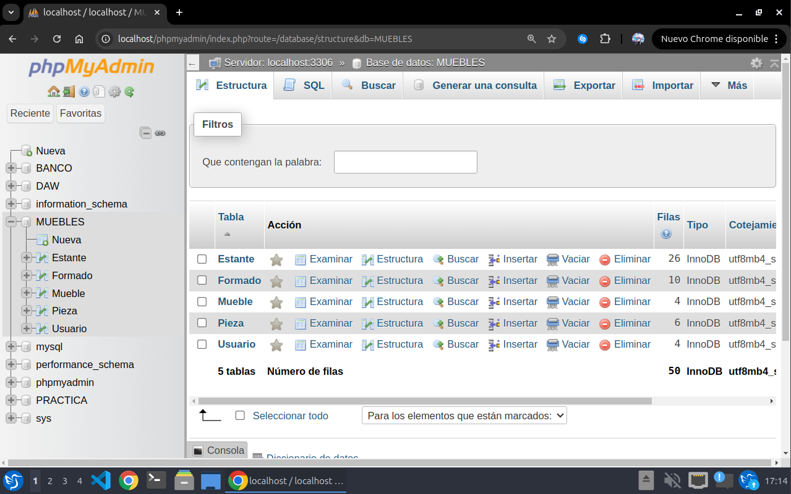
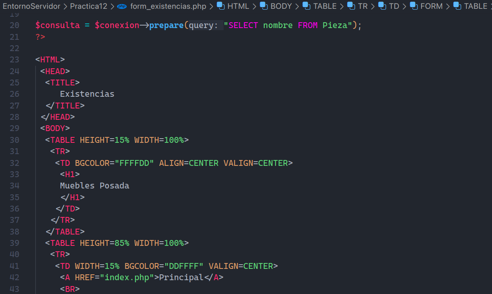
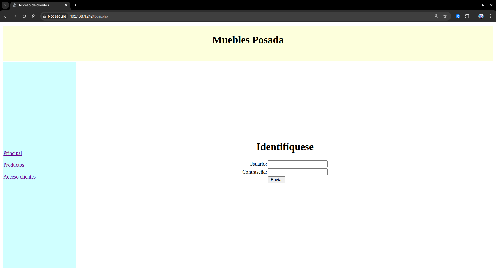

<style>
    .pagebreak {
        page-break-after: always;
    }
    h1 {
        page-break-before: always;
    }
</style>

# Práctica 12 - Gestión de almacén

## 1 Requisitos

Nuestro cliente, una fábrica de muebles, desea informatizar algunos procesos de su negocio para lo que nos solicita que diseñemos una aplicación WEB.
La información que pretende gestionar gira en torno a los muebles y las piezas que los componen. Los datos a tener en cuenta para los muebles son su código de mueble (único), su nombre y su precio. Todo mueble está formado por una o más piezas. Cada pieza tiene un identificador único, un nombre y una descripción. Cada pieza puede formar parte de varios muebles. Interesa saber cuántas unidades de cada pieza componen cada mueble.
**Por ejemplo, la mesa de televisión está formada por 3 piezas: tablero en 1 unidad, patas en 4 unidades y ruedas en 4 unidades.**
Todas las unidades de una pieza se encuentran en uno o más estantes del almacén. No se permite mezclar distintas piezas en cada estante. El estante viene determinado de forma única por dos valores: pasillo y altura. Además de en qué estantes están las piezas, interesa conocer cuantas unidades de la pieza hay almacenadas en cada estante.
**Por ejemplo, en el pasillo uno altura uno hay almacenadas 50 unidades de la pieza “Bisagra metal”. De dicha pieza hay un total de 173 unidades almacenadas en cuatro estantes de acuerdo con la siguiente distribución: 50, 50, 50 y 23.**
La aplicación WEB debe permitir:

- Solicitar un listado con todos los muebles. Para cada mueble se ha de mostrar su nombre y precio. Este listado debe estar disponible para todos los usuarios.

- La consulta de una pieza mostrando su nombre y unidades disponibles de esa pieza en el almacén. Este listado debe estar disponible sólo para usuarios identificados.

## 2 Base de datos

El equipo de bases de datos ha diseñado la base de datos de acuerdo al siguiente esquema relacional:

```sql
Mueble (#cod, nombre, precio);
Pieza (#cod, nombre, descripc);
Formado (#cod_mueble, #cod_pieza, unidades);
Estante (#pasillo, #altura,   cod_pieza, unidades);
Formado.cod_mueble ⊆ Mueble.cod;
Formado.cod_pieza ⊆ Pieza.cod;
Estante.cod_pieza ⊆ Pieza.cod;
```

A partir de dicho esquema se ha creado la base de datos. Dicha base de datos se puede importar desde un SGBD a partir del archivo “Muebles.sql” disponible en: <https://app.box.com/s/5u5rr9mblgcncszpi47jboh4df7sazyw>.

## 3 Presentación

El equipo de diseño WEB ha diseñado las páginas estáticas de la aplicación. El esquema general de las mismas contiene un menú situado a la izquierda. Cada menú de cada página incluye opciones que deben ser restringidas o no de acuerdo con los requisitos que se van a detallar. Las páginas que entrega el equipo de diseño WEB son:

- [X] index.php -> Página de inicio accesible para todos los usuarios.
- [X] listado.php -> Listado de muebles disponible para todos los usuarios.
- [X] login.php -> Página de acceso sólo accesible para usuarios anónimos. Esta página envía por método POST las variables user y pass.
- [X] user_page.php -> Página de bienvenida a usuarios identificados. No accesible desde menú.
- [X] form_existencias.php -> Página con desplegable de selección de pieza sólo accesible a usuarios identificados.
- [X] existencias.php -> Página no accesible desde menú con información de existencias de la pieza seleccionada en form_existencias. Dicha pieza se recoge por método POST de la variable “pieza”.
- [X] La opción del menú "Cerrar sesión" sólo estará disponible para usuarios identificados.

Las páginas estáticas se suministran en el archivo “www Muebles.zip” disponible en la URL: <https://app.box.com/s/k2fpf8ru1zyjtfv1pstxs0gqeqohqwo1>.

## 4 Se pide

Las tareas a realizar son:

- **Establecer plan de pruebas de validación.**

#### Pruebas

| # | Escenario | Entrada | Resultado Esperado |
|---|-----------|---------|--------------------|
| 1 | Página inicio (index.php) / Sesión no iniciada | Usuario hace click en **Principal** | Carga la página index.php y menú: **Principal, Productos y Acceso Clientes**|
| 2 | Página inicio (index.php) / Sesión iniciada usuario **plopez** | Usuario hace click en **Principal** | Carga la página index.php y menú: **Principal, Productos, Disponibilidad de piezas y Cerrar Sesión**|
| 3 | Página inicio (index.php) *En base de datos hay una tabla con distintos muebles* / Sesión no iniciada | Usuario hace click en **Productos** | Carga la página listado.php con una tabla con los muebles: *Mesa TV / 35.00€*, *Mesa de centro / 40.00€*, *Mes auxiliar / 20.00€* y *Mesa comedor plegable / 50.00€* y menú: **Principal, Productos y Acceso Clientes**|
| 4 | Página inicio (index.php) *En base de datos hay una tabla con distintos muebles* / Sesión iniciada usuario **plopez** | Usuario hace click en **Productos** | Carga la página listado.php con una tabla con los muebles: *Mesa TV / 35.00€*, *Mesa de centro / 40.00€*, *Mes auxiliar / 20.00€* y *Mesa comedor plegable / 50.00€* y menú: **Principal, Productos, Disponibilidad de piezas y Cerrar Sesión**|
| 5 | Página inicio (index.php) / Sesión no iniciada | Usuario hace click en **Acceso Clientes** | Carga la página login.php y menú: **Principal, Productos y Acceso Clientes** |
| 6 | Página inicio (index.php) / Sesión iniciada usuario **plopez** | Usuario hace click en **Cerrar Sesión** | Carga el archivo logout.php y redirige a index.php y menú: **Principal, Productos, Disponibilidad de piezas y Cerrar Sesión** |
| 7 | Página inicio (index.php) / Sesión iniciada usuario **plopez** | Usuario hace click en **Disponibilidad de piezas** | Carga la página form_existencias.php con un desplegable con las piezas **Bisagra metálica, Pata de madera 20cm, Pata de madera 50cm,    Rueda, Tablero de madera 20x20 y Tablero de madera 50x50** y menú **Principal, Productos, Disponibilidad de piezas y Cerrar Sesión**|
| 8 | Página inicio (index.php) / Sesión iniciada usuario **plopez** | Usuario hace click en **Disponibilidad de piezas** y selecciona **Bisagra metálica** | Carga la página **existencias.php** con las unidades que hay de Bisagra metálica y menú **Principal, Productos, Disponibilidad de piezas y Cerrar Sesión** |
| 9 | Página listado (listado.php) / Sesión no iniciada | Usuario hace click en **Principal** | Carga la página index.php y menú: **Principal, Productos y Acceso Clientes**|
| 10 | Página listado (listado.php) / Sesión iniciada usuario **plopez** | Usuario hace click en **Principal** | Carga la página index.php y menú: **Principal, Productos, Disponibilidad de piezas y Cerrar Sesión**|
| 11 | Página listado (listado.php) *En base de datos hay una tabla con distintos muebles* / Sesión no iniciada | Usuario hace click en **Productos** | Carga la página listado.php con una tabla con los muebles: *Mesa TV / 35.00€*, *Mesa de centro / 40.00€*, *Mes auxiliar / 20.00€* y *Mesa comedor plegable / 50.00€* y menú: **Principal, Productos y Acceso Clientes**|
| 12 | Página listado (listado.php) *En base de datos hay una tabla con distintos muebles* / Sesión iniciada usuario **plopez** | Usuario hace click en **Productos** | Carga la página listado.php con una tabla con los muebles: *Mesa TV / 35.00€*, *Mesa de centro / 40.00€*, *Mes auxiliar / 20.00€* y *Mesa comedor plegable / 50.00€* y menú: **Principal, Productos, Disponibilidad de piezas y Cerrar Sesión**|
| 13 | Página listado (listado.php) / Sesión no iniciada | Usuario hace click en **Acceso Clientes** | Carga la página login.php y menú: **Principal, Productos y Acceso Clientes** |
| 14 | Página listado (listado.php) / Sesión iniciada usuario **plopez** | Usuario hace click en **Cerrar Sesión** | Carga el archivo logout.php y redirige a index.php y menú: **Principal, Productos, Disponibilidad de piezas y Cerrar Sesión** |
| 15 | Página listado (listado.php) / Sesión iniciada usuario **plopez** | Usuario hace click en **Disponibilidad de piezas** | Carga la página form_existencias.php con un desplegable con las piezas **Bisagra metálica, Pata de madera 20cm, Pata de madera 50cm,    Rueda, Tablero de madera 20x20 y Tablero de madera 50x50** y menú **Principal, Productos, Disponibilidad de piezas y Cerrar Sesión**|
| 16 | Página listado (listado.php) / Sesión iniciada usuario **plopez** | Usuario hace click en **Disponibilidad de piezas** y selecciona **Bisagra metálica** | Carga la página **existencias.php** con las unidades que hay de Bisagra metálica y menú **Principal, Productos, Disponibilidad de piezas y Cerrar Sesión** |
| 17 | Página formulario existencias (form_existencias.php) / Sesión iniciada usuario **plopez** | Usuario hace click en **Principal** | Carga la página index.php y menú: **Principal, Productos, Disponibilidad de piezas y Cerrar Sesión**|
| 18 | Página formulario existencias (form_existencias.php) *En base de datos hay una tabla con distintos muebles* / Sesión iniciada usuario **plopez** | Usuario hace click en **Productos** | Carga la página listado.php con una tabla con los muebles: *Mesa TV / 35.00€*, *Mesa de centro / 40.00€*, *Mes auxiliar / 20.00€* y *Mesa comedor plegable / 50.00€* y menú: **Principal, Productos, Disponibilidad de piezas y Cerrar Sesión**|
| 19 | Página formulario existencias (form_existencias.php) / Sesión iniciada usuario **plopez** | Usuario hace click en **Cerrar Sesión** | Carga el archivo logout.php y redirige a index.php y menú: **Principal, Productos, Disponibilidad de piezas y Cerrar Sesión** |
| 20 | Página formulario existencias (form_existencias.php) / Sesión iniciada usuario **plopez** | Usuario selecciona **Bisagra metálica** | Carga la página **existencias.php** con las unidades que hay de Bisagra metálica y menú **Principal, Productos, Disponibilidad de piezas y Cerrar Sesión** |
| 21 | Página login (login.php) / Sesión no iniciada | Usuario hace click en **Principal** | Carga la página index.php y menú: **Principal, Productos y Acceso Clientes**|
| 22 | Página login (login.php) *En base de datos hay una tabla con distintos muebles* / Sesión no iniciada | Usuario hace click en **Productos** | Carga la página listado.php con una tabla con los muebles: *Mesa TV / 35.00€*, *Mesa de centro / 40.00€*, *Mes auxiliar / 20.00€* y *Mesa comedor plegable / 50.00€* y menú: **Principal, Productos y Acceso Clientes**|
| 23 | Página login (login.php) / Sesión no iniciada | Usuario hace click en **Acceso Clientes** | Carga la página login.php y menú: **Principal, Productos y Acceso Clientes** |
| 24 | Página login (login.php) / Sesión no iniciada | Usuario se identifica con usuario y contraseña correctos | Carga la página user_page.php y menú: **Principal, Productos, Disponibilidad de piezas y Cerrar Sesión** |
| 25 | Página existencias (existencias.php) / Sesión iniciada usuario **plopez** | Usuario hace click en **Principal** | Carga la página index.php y menú: **Principal, Productos, Disponibilidad de piezas y Cerrar Sesión**|
| 26 | Página existencias (existencias.php) *En base de datos hay una tabla con distintos muebles* / Sesión iniciada usuario **plopez** | Usuario hace click en **Productos** | Carga la página listado.php con una tabla con los muebles: *Mesa TV / 35.00€*, *Mesa de centro / 40.00€*, *Mes auxiliar / 20.00€* y *Mesa comedor plegable / 50.00€* y menú: **Principal, Productos, Disponibilidad de piezas y Cerrar Sesión**|
| 27 | Página existencias (existencias.php) / Sesión iniciada usuario **plopez** | Usuario hace click en **Cerrar Sesión** | Carga el archivo logout.php y redirige a index.php y menú: **Principal, Productos, Disponibilidad de piezas y Cerrar Sesión** |
| 28 | Página existencias (existencias.php) / Sesión iniciada usuario **plopez** | Usuario hace click en **Disponibilidad de piezas** | Carga la página form_existencias.php con un desplegable con las piezas **Bisagra metálica, Pata de madera 20cm, Pata de madera 50cm,    Rueda, Tablero de madera 20x20 y Tablero de madera 50x50** y menú **Principal, Productos, Disponibilidad de piezas y Cerrar Sesión**|
| 29 | Página existencias (existencias.php) / Sesión iniciada usuario **plopez** | Usuario hace click en **Disponibilidad de piezas** y selecciona **Bisagra metálica** | Carga la página **existencias.php** con las unidades que hay de Bisagra metálica y menú **Principal, Productos, Disponibilidad de piezas y Cerrar Sesión** |

- Desplegar la base de datos en la máquina Lubuntu que tiene LAMP y phpMyAdmin ya instalados.



- Desarrollar la aplicación WEB con consultas a la base de datos a partir de las páginas estáticas.



- Desplegar la aplicación.



- Pasar el plan de pruebas.
- Una memoria de todas las tareas realizadas.
