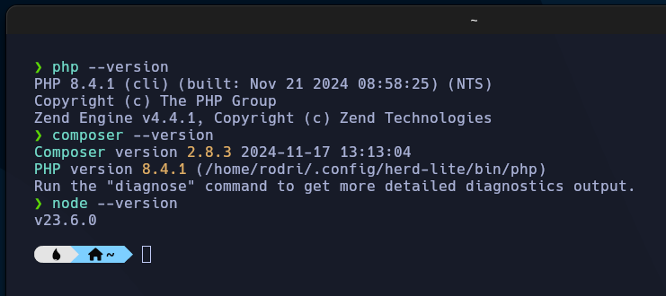
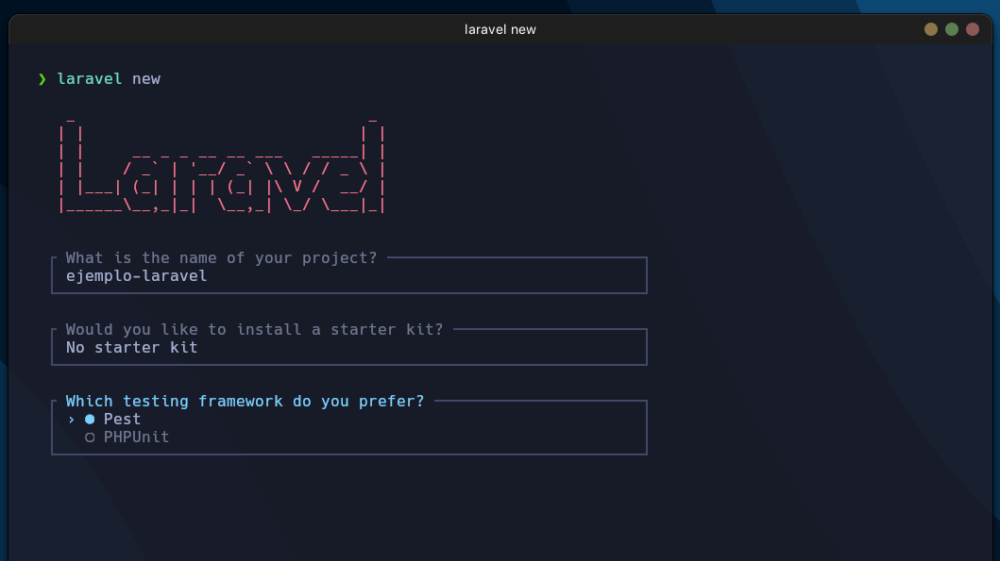
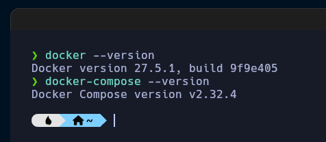
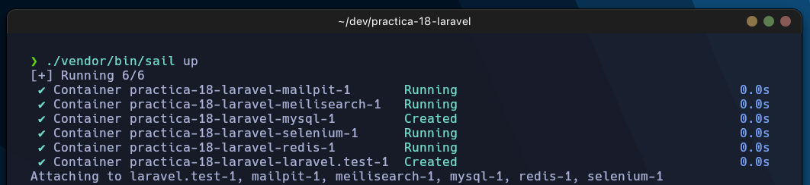

# Práctica 18 - Instalación de Laravel

## Se pide:

Contestad, razonad y justificad las siguientes cuestiones que se plantean.
Realizad una guía paso a paso con capturas de las tareas que se piden.
Documentad todas vuestras pruebas incluyendo un mapa lógico del escenario de pruebas en la documentación.

1. **¿Qué es un framework?**

Un framework es un conjunto de herramientas y librerías que facilitan el desarrollo de aplicaciones web. Estas herramientas y librerías permiten a los desarrolladores centrarse en la lógica de negocio de la aplicación, en lugar de tener que preocuparse por la gestión de la base de datos, la seguridad, la autenticación, etc.

2. **Cita frameworks para PHP.**

Algunos de los frameworks más populares para PHP son:

- Laravel
- Symfony
- CodeIgniter

3. **¿Qué es Laravel?**

Laravel es un framework de código abierto para PHP que sigue el patrón de diseño MVC (Modelo-Vista-Controlador). Laravel es uno de los frameworks más populares para PHP y es conocido por su facilidad de uso y su potencia.

4. **Instala Laravel en el entorno que consideres más adecuado.**

### Instalación Laravel en Linux en local

Para instalar Laravel en local necesitamos tener instalado **PHP**, **Composer** y **Node.js**.

Para instalar php y composer en Linux, podemos hacerlo con los siguientes comandos:

```bash
    /bin/bash -c "$(curl -fsSL https://php.new/install/linux/8.4)"
```

```bash
    php --version
    composer --version
    node --version
```

<p align="center">
  
</p>

Teniendo esto, podemos instalar Laravel con el siguiente comando:

```bash
    composer global require laravel/installer
```

Ahora podemos crear un nuevo proyecto de Laravel con el siguiente comando:

```bash
    laravel new
```

<p align="center">
  
</p>

Para levantar el servidor de Laravel, podemos hacerlo con el siguiente comando:

```bash
    php artisan serve
```

> [!NOTE]
> Si da error de MySQL ejecutar el siguiente comando.

```bash
    php artisan migrate
```

### Instalación Laravel con Docker

Para instalar Laravel necesitamos tener antes instalado **Docker** y **Docker Compose**.

```bash
    docker --version
    docker-compose --version
```

<p align="center">
  
</p>

Teniendo esto podemos descargar la imagen de Laravel con el siguiente comando:

```bash
    curl -s https://laravel.build/ejemplo-laravel | bash
```

Con el proyecto creado podemos levantar el contenedor con el siguiente comando:

```bash
    cd ejemplo-laravel
    ./vendor/bin/sail up
```

<p align="center">
  
</p>
