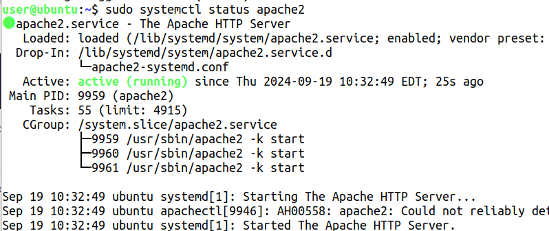
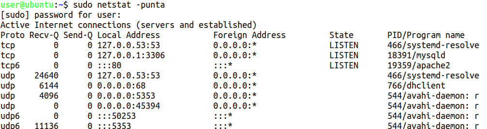
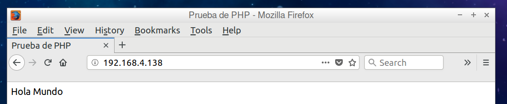

# Práctica 2 - Entorno de trabajo

## Mediante información obtenida en Internet, libro de texto, etc.; realizad las tareas y contestad las preguntas que se plantean

1. **¿Cómo es la arquitectura de una aplicación WEB creada con PHP?**

Funciona con el patrón arquitectonico **MVC** (Modelo Vista Controlador), donde el modelo se encarga de la lógica de la aplicación, la vista de la presentación de la información y el controlador de la interacción entre el modelo y la vista.

2. **De acuerdo con ello, ¿qué ingredientes son necesarios para trabajar?**
3. **En una máquina virtual Linux de las facilitadas en el aula instalad LAMP.**

Para instalar LAMP en una máquina virtual Linux, primero debemos actualizar los repositorios de la máquina con el comando `sudo apt update` y luego instalar los paquetes necesarios con el comando `sudo apt install apache2 mysql-server php libapache2-mod-php php-mysql`.

4. **Explica las diferentes maneras que hay para comprobar que están funcionando los servidores.**

Se puede ver con el comando `sudo netstat -punta`

5. **Realizad una página "Hola mundo" en PHP. Recordad que si no está probado no está hecho.**

6. **Explicad cómo comprobar que está funcionando el intérprete.**

Se puede comprobar con el comando `php -v` ademas de hacer un hola mundo y ver si se muestra en el navegador.
