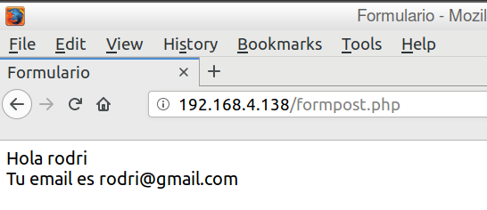
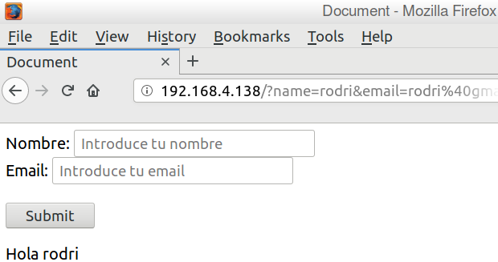

# Práctica 3 - Formularios

## Los formularios permiten al usuario enviar datos al servidor para ser procesados. Mediante información obtenida en Internet, libro de texto, etc.; realizad las tareas y contestad las preguntas que se plantean.

1. **Realizad un sencilla aplicación WEB en una de cuyas páginas se solicite la entrada de ciertos datos mediante un formulario. Al enviar dichos datos se debe mostrar una página que los escriba lo que permitirá comprobar que se han enviado bien. Realizad dicha aplicación WEB en versión con método GET y POST.**

- POST

- GET

2. **¿Cuáles son las diferencias entre los métodos GET y POST?**

La diferencia es que con el método GET se ven los valores introducidos en la url y el método POST no.
