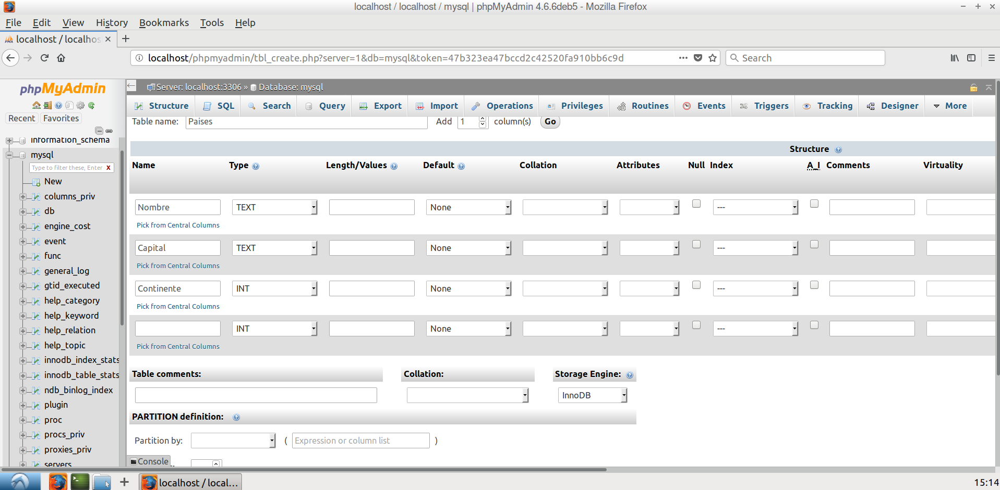
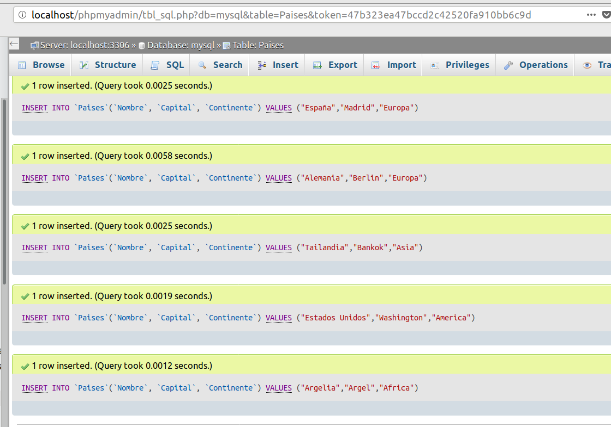

# Práctica 6 - Acceso a base de datos

## Mediante información obtenida en Internet, libro de texto, etc.; realizad las tareas y contestad las preguntas que se plantean

1. **Instalad phpMyAdmin.**

2. **Desde phpMyAdmin cread una base de datos.**

3. **Cread en dicha base de datos una tabla con dos campos por registro. Un campo será un dato y el otro cierta información asociada al valor del primer campo. Todo a vuestra elección.**

4. **Realizad un sencillo sitio WEB en una de cuyas páginas se solicite la entrada de un dato mediante un formulario. Al enviar dicho dato se debe devolver la información asociada al mismo en base de datos.**

