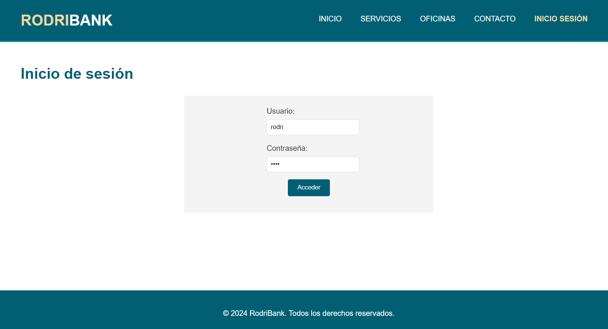
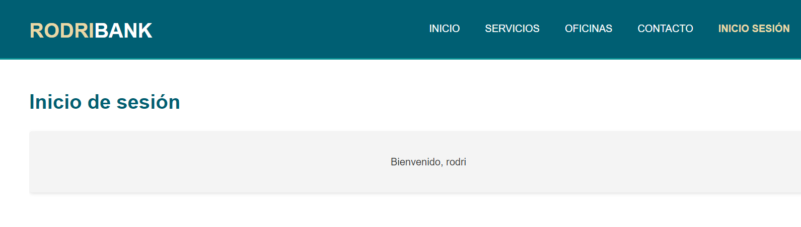
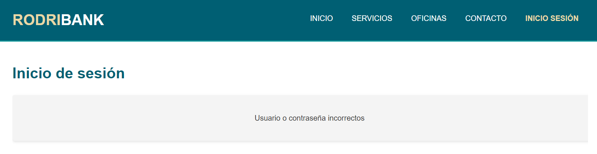

# Práctica 8 - Preparando las sesiones

## Realizad un sitio WEB con las siguientes características

1. **Todo el sitio WEB estará compuesto por páginas que tengan una estructura y estilo similar. No se piden virguerías en HTML, se pide legibilidad y unicidad estilística**
2. **Deberá haber al menos las siguientes secciones: Inicio, Servicios, Oficinas y Acceso clientes.**
3. **Desde cualquier sección se debe poder acceder a cualquier otra. Para ello es necesario que haya un menú siempre accesible.**
4. **La sección "Acceso clientes" consistirá en un formulario con campos usuario y contraseña. Si el usuario y contraseña introducidos son válidos se debe mostrar una página que informe de ello y otra en caso contrario.**

## Plan de pruebas (incremental de la práctica 7)

| Escenario | Entrada | Resultado Esperado |
|-----------|---------|--------|
| Página de inicio (**indexBanco.php**) | Usuario hace click en el logo RodriBank | Carga la página de inicio (indexBanco.php) |
| Página de inicio (**indexBanco.php**) | Usuario hace click en INICIO | Carga la página de inicio (indexBanco.php) |
| Página de inicio (**indexBanco.php**) | Usuario hace click en SERVICIOS | Carga la página de servicios (servicios.php) |
| Página de inicio (**indexBanco.php**) | Usuario hace click en OFICINAS | Carga la página de oficinas (oficinas.php) |
| Página de inicio (**indexBanco.php**) | Usuario hace click en CONTACTO | Carga la página de contacto (contacto.php) |
| Página de servicios (**servicios.php**) | Usuario hace click en el logo RodriBank | Carga la página de inicio (indexBanco.php) |
| Página de servicios (**servicios.php**) | Usuario hace click en INICIO | Carga la página de inicio (indexBanco.php) |
| Página de servicios (**servicios.php**) | Usuario hace click en SERVICIOS | Carga la página de servicios (servicios.php) |
| Página de servicios (**servicios.php**) | Usuario hace click en OFICINAS | Carga la página de oficinas (oficinas.php) |
| Página de servicios (**servicios.php**) | Usuario hace click en CONTACTO | Carga la página de contacto (contacto.php) |
| Página de oficinas (**oficinas.php**) | Usuario hace click en el logo RodriBank | Carga la página de inicio (indexBanco.php) |
| Página de oficinas (**oficinas.php**) | Usuario hace click en INICIO | Carga la página de inicio (indexBanco.php) |
| Página de oficinas (**oficinas.php**) | Usuario hace click en SERVICIOS | Carga la página de servicios (servicios.php) |
| Página de oficinas (**oficinas.php**) | Usuario hace click en OFICINAS | Carga la página de oficinas (oficinas.php) |
| Página de oficinas (**oficinas.php**) | Usuario hace click en CONTACTO | Carga la página de contacto (contacto.php) |
| Página Oficinas (**oficinas.php**) *En la base de datos hay un registro de una ciudad con nombre: **Madrid**, direccion postal: **28018**, horario: **9:00 a 17:00** y un mapa*| Usuario selecciona una ciudad dada en el desplegable y hace click en **ver oficina** | Se muestra los apartados de nombre: **Madrid**, dirección postal: **28018**, horario: **9:00 a 17:00** y mapa |
| Página Oficinas (**oficinas.php**) | El usuario, sin seleccionar una ciudad y con la opcion por defecto, hace click en **ver oficina** | Vuelve a cargar la página de oficinas (oficinas.php) |
| Página Oficinas (**oficinas.php**) *No existe nongún registro en la base de datos con el nombre **awdawdds***| El usuario, inspeccionando el código de la página cambia el valor de cualquiera de las opciones por **awdawdds** que no está en la base de datos | Muestra los apartados pero con el mensaje de que **no** se ha encontrado la información de **awdawdds** y el mapa **NO** aparece |
| Página de contacto (**contacto.php**) | Usuario hace click en el logo RodriBank | Carga la página de inicio (indexBanco.php) |
| Página de contacto (**contacto.php**) | Usuario hace click en INICIO | Carga la página de inicio (indexBanco.php) |
| Página de contacto (**contacto.php**) | Usuario hace click en SERVICIOS | Carga la página de servicios (servicios.php) |
| Página de contacto (**contacto.php**) | Usuario hace click en OFICINAS | Carga la página de oficinas (oficinas.php) |
| Página de contacto (**contacto.php**) | Usuario hace click en CONTACTO | Carga la página de contacto (contacto.php) |
| Página Contacto (**contacto.php**) | El usuario rellena todos los campos correctamente y hace click en el botón enviar | Carga la página **mail.php** con el mensaje de confirmación: **Gracias por contactarnos, *'Nombre que haya puesto el usuario'*. Hemos enviado un correo de confirmación** |
| Página Contacto (**contacto.php**) | El usuario no rellena todos los campos y hace click en el botón enviar | Muestra un mensaje de error indicando que faltan campos por rellenar y hasta que no rellene todos los campos correctamente no envía nada |
| Página de confirmación de mail (**mail.php**) | Usuario hace click en el logo RodriBank | Carga la página de inicio (indexBanco.php) |
| Página de confirmación de mail (**mail.php**) | Usuario hace click en INICIO | Carga la página de inicio (indexBanco.php) |
| Página de confirmación de mail (**mail.php**) | Usuario hace click en SERVICIOS | Carga la página de servicios (servicios.php) |
| Página de confirmación de mail (**mail.php**) | Usuario hace click en OFICINAS | Carga la página de oficinas (oficinas.php) |
| Página de confirmación de mail (**mail.php**) | Usuario hace click en CONTACTO | Carga la página de contacto (contacto.php) |
| Página de inicio de sesión (**sesion.php**) | Usuario hace click en el logo RodriBank | Carga la página de inicio (indexBanco.php) |
| Página de inicio de sesión (**sesion.php**) | Usuario hace click en INICIO | Carga la página de inicio (indexBanco.php) |
| Página de inicio de sesión (**sesion.php**) | Usuario hace click en SERVICIOS | Carga la página de servicios (servicios.php) |
| Página de inicio de sesión (**sesion.php**) | Usuario hace click en OFICINAS | Carga la página de oficinas (oficinas.php) |
| Página de inicio de sesión (**sesion.php**) | Usuario hace click en CONTACTO | Carga la página de contacto (contacto.php) |
| Página de inicio de sesión (**sesion.php**) *En base de datos hay un registro en la tabla **Usuarios** con el nombre **rodri** y la contraseña **1234*** | Se introduce el usuario **rodri** y contraseña **1234** correctamente | Carga la página de validación (**verificacion.php**) con el mensaje *"Bienvenido, rodri"* |
| Página de inicio de sesión (**sesion.php**) *En base de datos **No** hay un registro en la tabla **Usuarios** con el nombre **test** y la contraseña **test*** | Se introduce el usuario **test** y la contraseña **test** | Carga la página de validación (**verificacion.php**) con el mensaje *"Usuario y/o contraseña incorrectos"* |
