# Apuntes Interfaces Web

## Primera Evaluación

### w3schools.com

#### 1. Título y párrafos

[Try HTML Introduction](https://www.w3schools.com/html/tryit.asp?filename=tryhtml_intro)


#### 2. Tamaños

[Try HTML Basic Headings](https://www.w3schools.com/html/tryit.asp?filename=tryhtml_basic_headings)


#### 3. Diferentes párrafos

[Try HTML Paragraphs](https://www.w3schools.com/html/tryit.asp?filename=tryhtml_basic_paragraphs)


#### 4. Intro con break

[Try HTML Line Breaks](https://www.w3schools.com/html/tryit.asp?filename=tryhtml_element_br)


#### 5. Enlaces

[Try HTML Links](https://www.w3schools.com/html/tryit.asp?filename=tryhtml_basic_link)


#### 6. Imágenes

[Try HTML Images](https://www.w3schools.com/html/tryit.asp?filename=tryhtml_basic_img)


#### 7. Estilos

[Try HTML Styles](https://www.w3schools.com/html/tryit.asp?filename=tryhtml_basic_style)


#### 8. Estilos 2

[Try HTML Styles 2](https://www.w3schools.com/html/tryit.asp?filename=tryhtml_basic_style2)


#### 9. Fondo

[Try HTML Background](https://www.w3schools.com/html/tryit.asp?filename=tryhtml_styles_background-color)


#### 10. Fondo 2

[Try HTML Background 2](https://www.w3schools.com/html/tryit.asp?filename=tryhtml_styles_background-color2)


#### 11. Regla horizontal

[Try HTML Horizontal Rules](https://www.w3schools.com/html/tryit.asp?filename=tryhtml_headings_hr)


#### 12. Etiqueta previa

[Try HTML Pre](https://www.w3schools.com/html/tryit.asp?filename=tryhtml_pre)


#### 13. Fuentes

[Try HTML Fonts](https://www.w3schools.com/html/tryit.asp?filename=tryhtml_styles_font-family)


#### 14. Alineamiento

[Try HTML Text Alignment](https://www.w3schools.com/html/tryit.asp?filename=tryhtml_styles_text-align)


#### 15. Negrita, cursiva, subínice y superíndice

[Try HTML Text Formatting](https://www.w3schools.com/html/tryit.asp?filename=tryhtml_formatting_intro)


#### 16. Small

[Try HTML Small](https://www.w3schools.com/html/tryit.asp?filename=tryhtml_formatting_small)


#### 17. Mark

[Try HTML Mark](https://www.w3schools.com/html/tryit.asp?filename=tryhtml_formatting_mark)


#### 18. Del

[Try HTML Del](https://www.w3schools.com/html/tryit.asp?filename=tryhtml_formatting_del)


#### 19. Ins

[Try HTML Ins](https://www.w3schools.com/html/tryit.asp?filename=tryhtml_formatting_ins)


#### 20. Strong

[Try HTML Strong](https://www.w3schools.com/html/tryit.asp?filename=tryhtml_formatting_strong)


<!-- TODO puntos 21 al 24 -->

#### 25. Colores de fondo

[Try HTML Background Color](https://www.w3schools.com/html/tryit.asp?filename=tryhtml_color)


#### 26. Colores de texto

[Try HTML Text Color](https://www.w3schools.com/html/tryit.asp?filename=tryhtml_color_text)


#### 27. Colores de borde

[Try HTML Border Color](https://www.w3schools.com/html/tryit.asp?filename=tryhtml_border_color)


#### 28. Formas de color

[Try HTML Color Values](https://www.w3schools.com/html/tryit.asp?filename=tryhtml_color_values)


#### 29. Inline / Internal / External

La diferencias entre los estilos inline, internal y external son:

- **Inline**: se aplica directamente en la etiqueta HTML.

```html
<h1 style="color:blue;">Esto es un titulo azul</h1>
```

- **Internal**: se aplica en la cabecera del documento HTML.

```html
<!DOCTYPE html>
<html>
    <head>
        <style>
            body {background-color: powderblue;}
            h1   {color: blue;}
            p    {color: red;}
        </style>
    </head>
    <body>
        <h1>Titulo</h1>
        <p>Texto</p>
    </body>
</html>
```

- **External**: se aplica en un archivo CSS externo.

```css
body {
    background-color: powderblue;
    with: 50%;
    margin: auto;
    padding: 10px;
    text-align: center;
}
```

#### 35. Padding

[Try HTML Padding](https://www.w3schools.com/html/tryit.asp?filename=tryhtml_css_padding)


#### 36. Margin

[Try HTML Margin](https://www.w3schools.com/html/tryit.asp?filename=tryhtml_css_margin)


#### 37. Hipervinculos

[Try HTML Links](https://www.w3schools.com/html/tryit.asp?filename=tryhtml_links_target)


#### 38. URL Absoluto

[Try HTML Links Absolute URL](https://www.w3schools.com/html/tryit.asp?filename=tryhtml_links)


#### 39. Imagen como hipervinculo

[Try HTML Image as Link](https://www.w3schools.com/html/tryit.asp?filename=tryhtml_links_image)


#### 40. Enlace a un correo

[Try HTML Mailto Link](https://www.w3schools.com/html/tryit.asp?filename=tryhtml_links_mailto)


#### 41. Enlace en un botón

[Try HTML Button Link](https://www.w3schools.com/html/tryit.asp?filename=tryhtml_links_button)


#### 42. Enlace en un título

[Try HTML Title Link](https://www.w3schools.com/html/tryit.asp?filename=tryhtml_links_title)


#### 43. Colores de enlaces

[Try HTML Link Colors](https://www.w3schools.com/html/tryit.asp?filename=tryhtml_links_colors)


#### 44. Botón de enlace personalizado

[Try HTML Link Button](https://www.w3schools.com/html/tryit.asp?filename=tryhtml_links_button)


#### 45. Enlaces internos

[Try HTML Internal Links](https://www.w3schools.com/html/tryit.asp?filename=tryhtml_links_bookmark)


#### 46. Imagenes

[Try HTML Images](https://www.w3schools.com/html/tryit.asp?filename=tryhtml_images)


#### 47. Mejor style

[Try HTML Better Style](https://www.w3schools.com/html/tryit.asp?filename=tryhtml_images_better)


#### 48. Carpeta de imagenes

[Try HTML Image Folder](https://www.w3schools.com/html/tryit.asp?filename=tryhtml_images_folder)


#### 49. Gif

[Try HTML Image Gif](https://www.w3schools.com/html/tryit.asp?filename=tryhtml_images_gif)

#### 50. Imagenes flotantes

[Try HTML Image Float](https://www.w3schools.com/html/tryit.asp?filename=tryhtml_images_float)


#### 51. Mapa de imágenes


#### 52. Rect - Define un rectángulo


#### 53. Circle - Define un circulo


#### 54. Poly - A varios puntos


#### 55. Imagen de fondo de elemento p


#### 56. Imagen de fondo en una página


#### 57. Repetición de fondo


#### 58. Fondo que no se repita


#### 59. Portada de fondo


#### 60. Estiramiento de fondo


#### 61. Elemento imagen

[Try HTML Image Element](https://www.w3schools.com/html/tryit.asp?filename=tryhtml_images_picture1)


#### 62. Imagen de fondo

#### 63. Favicon

#### 64. Tablas

[Try HTML Tables](https://www.w3schools.com/html/tryit.asp?filename=tryhtml_table_intro)


#### 65. Tablas con bordes

[Try HTML Table Border](https://www.w3schools.com/html/tryit.asp?filename=tryhtml_table_border)


#### 66. Encabezado de tabla

[Try HTML Table Headings](https://www.w3schools.com/html/tryit.asp?filename=tryhtml_table_border)


#### 67. Varias funciones

`<table>` Define una tabla
`<tr>` Define una fila en una tabla
`<th>` Define una celda de encabezado en una tabla
`<td>` Define una celda en una tabla
`<caption>` Define el título de una tabla
`<colgroup>` Define un grupo de columnas en una tabla
`<col>` Define las propiedades de las columnas en una tabla
`<thead>` Define un grupo de encabezados en una tabla
`<tbody>` Define un grupo de filas en una tabla
`<tfoot>` Define un grupo de pies de tabla en una tabla

#### 68. Tablas con css

[Try HTML Table CSS](https://www.w3schools.com/html/tryit.asp?filename=tryhtml_table_border)


#### 69. Contraer bordes de tablas

[Try HTML Table Collapse](https://www.w3schools.com/html/tryit.asp?filename=tryhtml_table_collapse)


#### 70. Bordes de tablas de estilo

[Try HTML Table Border Style](https://www.w3schools.com/html/tryit.asp?filename=tryhtml_table_border_style)


#### 71. Listas

[Try HTML Lists](https://www.w3schools.com/html/tryit.asp?filename=tryhtml_lists_intro)
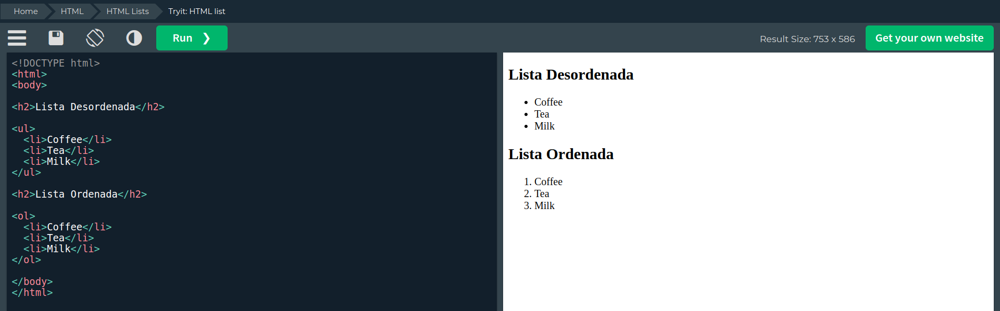

#### 72. Lista de descripcion

[Try HTML Description Lists](https://www.w3schools.com/html/tryit.asp?filename=tryhtml_lists_description)
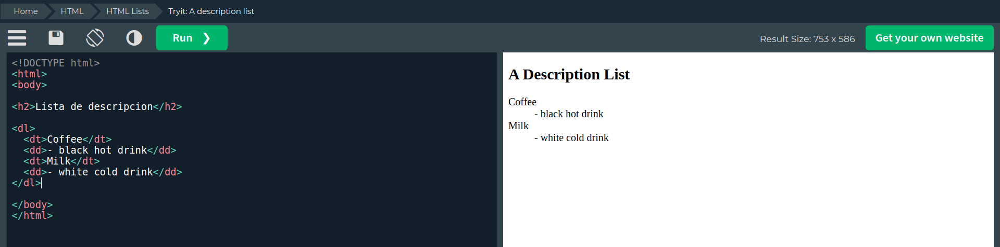

#### 73. Etiquetas de lista HTML

`<ul>` Define una lista desordenada
`<ol>` Define una lista ordenada
`<li>` Define un elemento de lista
`<dl>` Define una lista de descripción
`<dt>` Define un término en una lista de descripción
`<dd>` Define una descripción de un término en una lista de descripción

#### 74. Elementos en linea

Un elemento de linea no comienza en una nueba lineam solo ocupa el ancho necesario. Este es un elemento `<span>` dentro de un párrafo.
[Try HTML Inline](https://www.w3schools.com/html/tryit.asp?filename=tryhtml_span)
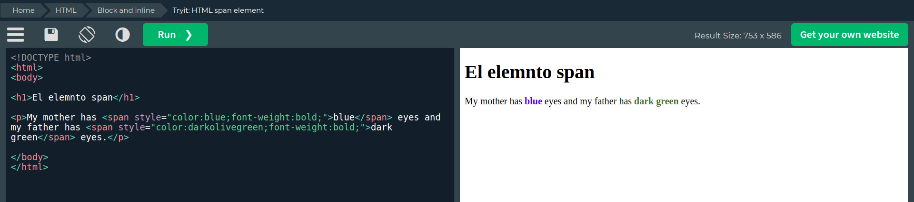

#### 75. Elemento div

El elemento `<div>` es un contenedor de bloque que se utiliza para agrupar elementos HTML y aplicar estilos a estos con CSS.

[Try HTML Div](https://www.w3schools.com/html/tryit.asp?filename=tryhtml_div)
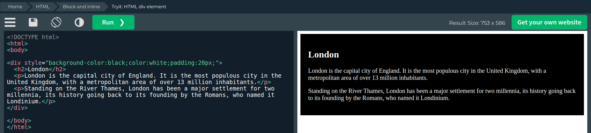

#### 76. Elemento span

El elemento `<span>` es un contenedor en línea que se utiliza para marcar partes de un texto o parte de un documento.

[Try HTML Span](https://www.w3schools.com/html/tryit.asp?filename=tryhtml_span)
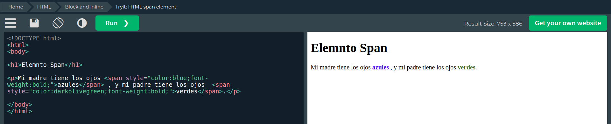

#### 77. Alinear centro un elemento div

[Try HTML Div Center](https://www.w3schools.com/html/tryit.asp?filename=tryhtml_div3)
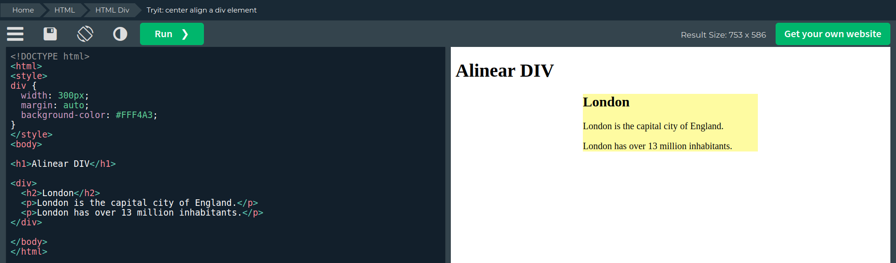

#### 78. Multiples elementos div

[Try HTML Multiple Divs](https://www.w3schools.com/html/tryit.asp?filename=tryhtml_div4)
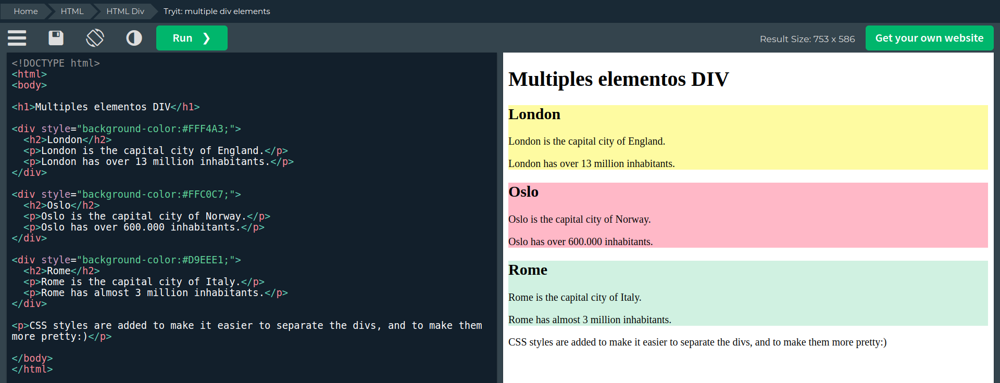

#### 79. Elementos div horizontales

[Try HTML Div Horizontal](https://www.w3schools.com/html/tryit.asp?filename=tryhtml_div_float)
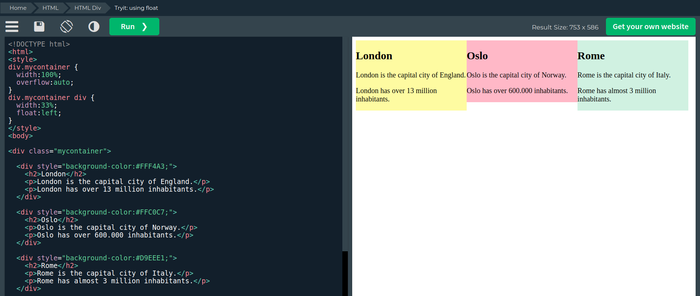

#### 80. Bloque en línea

Si cambia la propiedad de visualización del elemento `<div>` de bloque a bloque en línea, los elementos `<div>` ya no agregarán un salto de línea antes y después, y se mostrarán uno al lado del otro en lugar de uno encima de otro.

[Try HTML Inline Block](https://www.w3schools.com/html/tryit.asp?filename=tryhtml_div_inline-block)
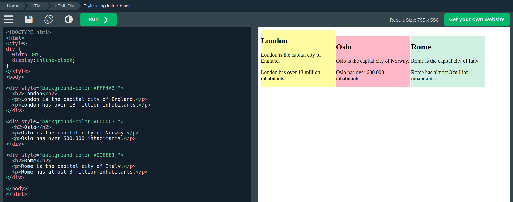

## Segunda Evaluación

### ddw

#### 1. Marcos Flotantes

[Try HTML Float](https://www.w3schools.com/html/tryit.asp?filename=tryhtml_iframe_height_width)
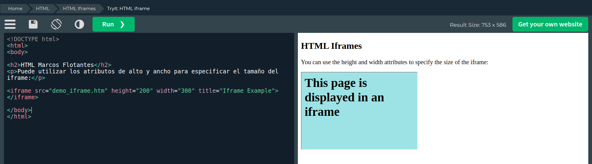

#### 2. Estilo de marco

[Try HTML Float](https://www.w3schools.com/html/tryit.asp?filename=tryhtml_iframe_height_width)
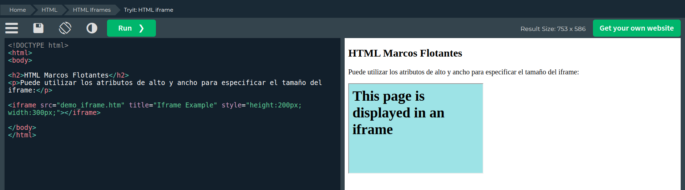

#### 3. Iframe - Eliminar el borde

[Try HTML Float](https://www.w3schools.com/html/tryit.asp?filename=tryhtml_iframe_frameborder)


#### 4. Iframe - Destino (objetivo) de un enlace

[Try HTML Float](https://www.w3schools.com/html/tryit.asp?filename=tryhtml_iframe_target)
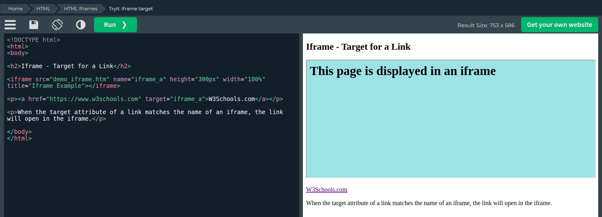

#### 5. Mi primer javascript

[Try HTML Float](https://www.w3schools.com/html/tryit.asp?filename=tryhtml_scripts_intro)
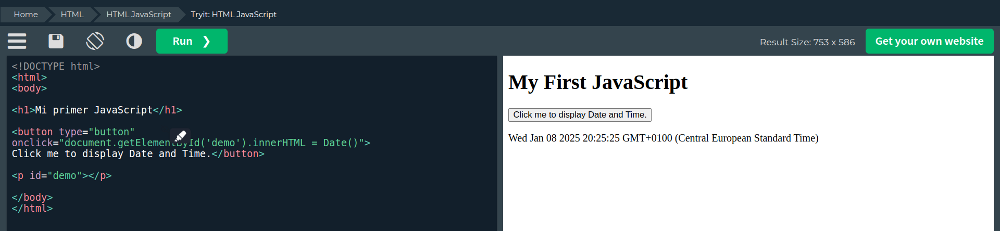

#### 6. Una muestra de Javascript

[Try HTML Float](https://www.w3schools.com/html/tryit.asp?filename=tryhtml_script_html)
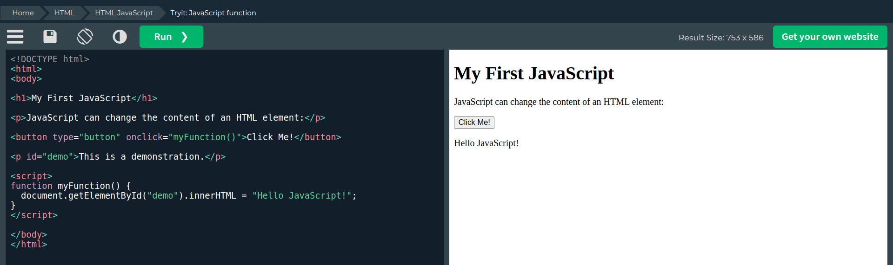

#### 7. Javascript puede cambiar estilos

[Try HTML Float](https://www.w3schools.com/html/tryit.asp?filename=tryhtml_script_styles)
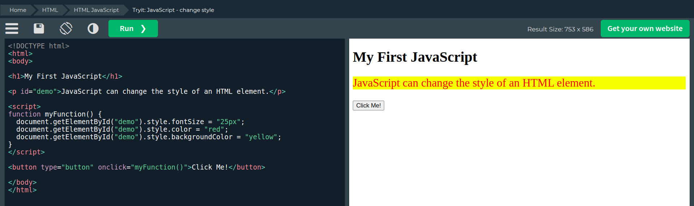

#### 8. Javascript puede cambiar atributos

[Try HTML Float](https://www.w3schools.com/html/tryit.asp?filename=tryhtml_script_attribute)


#### 9. Noscript

La etiqueta `<noscript>` se utiliza para proporcionar contenido alternativo para los navegadores que no admiten scripts o que tienen los scripts desactivados.
[Try HTML Float](https://www.w3schools.com/html/tryit.asp?filename=tryhtml_noscript)
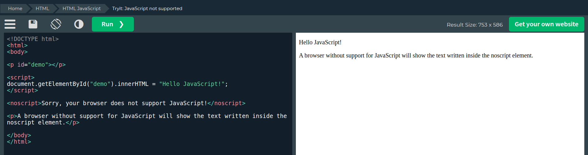

#### 11. Una ruta de archivo la ubicación de un archivo en la estructura de carpetas de un sitio web. Las rutas de archivos se utilizan al vincular archivos externos, como

- Hojas de estilo CSS
- Archivos JavaScript
- Imágenes
- Páginas web

#### 13. Rutas relativas

Una ruta de archivo apunta a un archivo relativo a la página actual.
En el siguiente ejemplo, la ruta de archivo apunta a un archivo en la carpeta de imágenes del sitio web:

[Try HTML Float](https://www.w3schools.com/html/tryit.asp?filename=tryhtml_files_relative)
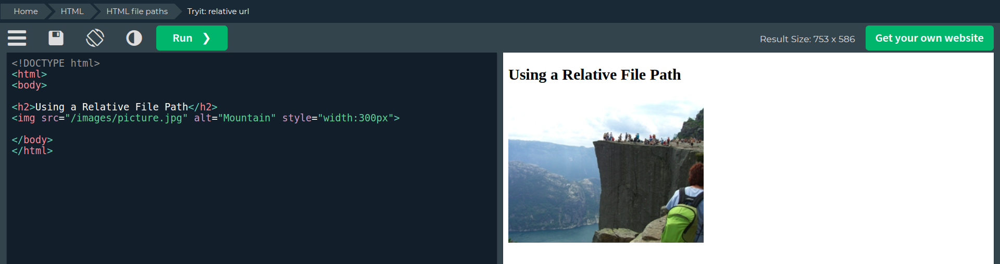

#### 14. Utilizar rutas de archivos relativas

Al utilizar rutas de archivos relativas, las páginas web no estarán vinculadas a su URL base actual. Todos los enlaces funcionarán en su propio ordenador (localhost), así como en su dominio público actual.

#### 15. Elementos y tecnicas de diseño HTML

- `<header>`: Define un encabezado para un documento o una sección.
- `<nav>`: Define enlaces de navegación.
- `<section>`: Define una sección en un documento.
- `<article>`: Define un artículo.
- `<aside>`: Define contenido aparte del contenido principal.
- `<footer>`: Define un pie de página para un documento o una sección.
- `<details>`: Define detalles adicionales que el usuario puede ver o ocultar.
- `<summary>`: Define un encabezado visible para un elemento `<details>`.

#### 16. Técnicas para columnas

- CSS Frameworks
- CSS Float
- CSS Flexbox
- CSS Grid

#### 17. CSS Float

La propiedad CSS float se utiliza para colocar un elemento a la izquierda o a la derecha de su contenedor, lo que permite que el texto y otros elementos fluyan alrededor de él.

[Try HTML Float](https://www.w3schools.com/html/tryit.asp?filename=tryhtml_layout_float)
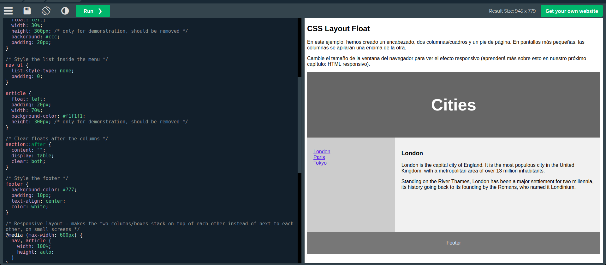
